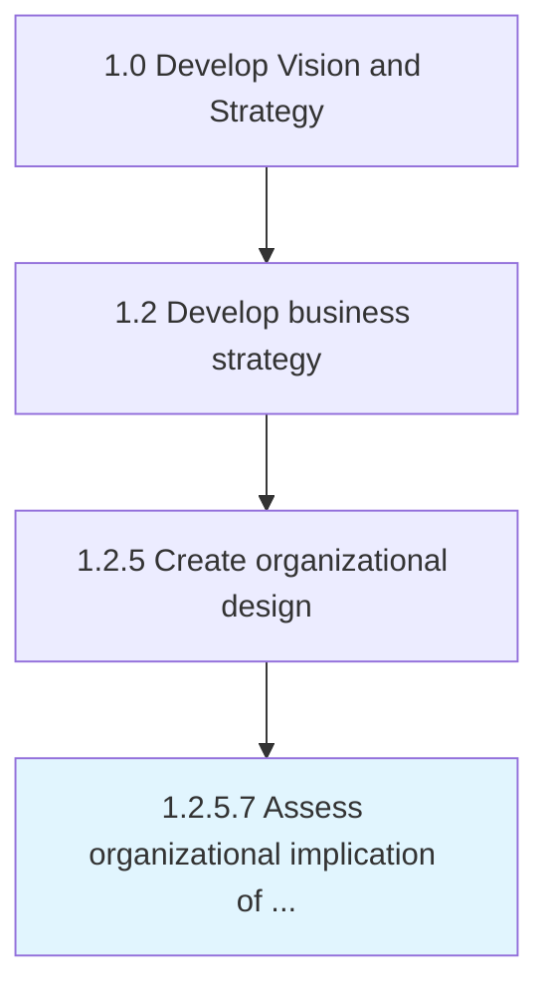

# Assess organizational implication of feasible alternatives

> Probing the repercussions of all practicable organizational design options.

## Overview

Activity 1.2.5.7 is an activity within the Develop Vision and Strategy framework. 

Probing the repercussions of all practicable organizational design options. Analyze the significance and impact of workable organizational structure options. Closely examine the long-term impact of these frameworks over the functioning of the organization.

## Process Hierarchy



## Key Statistics

| Metric | Value |
|--------|-------|
| APQC Code | 10055 |
| Hierarchy ID | 1.2.5.7 |
| Level | Activity |
| Parent | [1.2.5](../) |
| Sub-Processes | 0 |


## GraphDL Semantic Structure

```
assess.OrganizationalImplication.of.FeasibleAlternatives
```

| Component | Value | Description |
|-----------|-------|-------------|
| Verb | `assess` | Primary action |
| Object | `organizational implication` | Direct object |
| Preposition | `of` | Relationship |
| PrepObject | `feasible alternatives` | Indirect object |


## Related Concepts

- [OrganizationalImplication](/concepts/OrganizationalImplication)
- [FeasibleAlternatives](/concepts/FeasibleAlternatives)


---

*Source: APQC PCF 10055 (1.2.5.7) - APQC*
