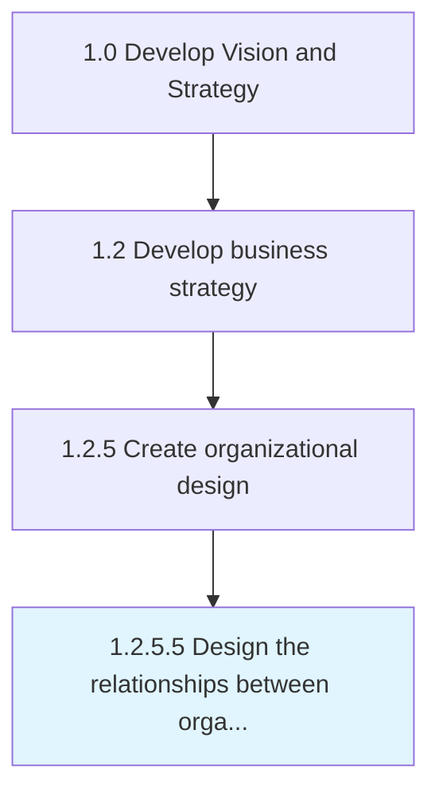

# Design the relationships between organizational units

> Fleshing out the connections and dependencies among the various units of the organization.

## Overview

Activity 1.2.5.5 is an activity within the Develop Vision and Strategy framework. 

Fleshing out the connections and dependencies among the various units of the organization. Delineate the relationship among business units or process frameworks within the organization, in terms of activities, synergies, and shared resources and responsibilities. Formalize relationships among business units so that any mutual coherence is clearly understood and can be attended to.

## Process Hierarchy



## Key Statistics

| Metric | Value |
|--------|-------|
| APQC Code | 10053 |
| Hierarchy ID | 1.2.5.5 |
| Level | Activity |
| Parent | [1.2.5](../) |
| Sub-Processes | 0 |


## GraphDL Semantic Structure

```
design.TheRelationshipsBetweenOrganizationalUnits
```

| Component | Value | Description |
|-----------|-------|-------------|
| Verb | `design` | Primary action |
| Object | `the relationships between organizational units` | Direct object |


## Related Concepts

- Relationships
- OrganizationalUnits


---

*Source: APQC PCF 10053 (1.2.5.5) - APQC*
