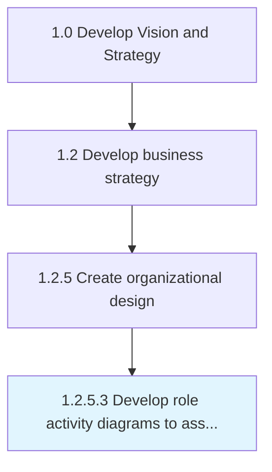

# Develop role activity diagrams to assess hand-off activity

> Examining the constituent exercises and undertakings within a work-related position for the purpose of effective delegation.

## Overview

Activity 1.2.5.3 is an activity within the Develop Vision and Strategy framework. 

Examining the constituent exercises and undertakings within a work-related position for the purpose of effective delegation. Deconstruct job-specific roles into activities and visualize the relations among them, with the objective of assigning responsibilities to the appropriate personnel.

## Process Hierarchy



## Key Statistics

| Metric | Value |
|--------|-------|
| APQC Code | 10051 |
| Hierarchy ID | 1.2.5.3 |
| Level | Activity |
| Parent | [1.2.5](../) |
| Sub-Processes | 0 |


## GraphDL Semantic Structure

```
develop.RoleActivityDiagrams.to.AssessHandoffActivity
```

| Component | Value | Description |
|-----------|-------|-------------|
| Verb | `develop` | Primary action |
| Object | `role activity diagrams` | Direct object |
| Preposition | `to` | Relationship |
| PrepObject | `assess hand-off activity` | Indirect object |


---

*Source: APQC PCF 10051 (1.2.5.3) - APQC*
