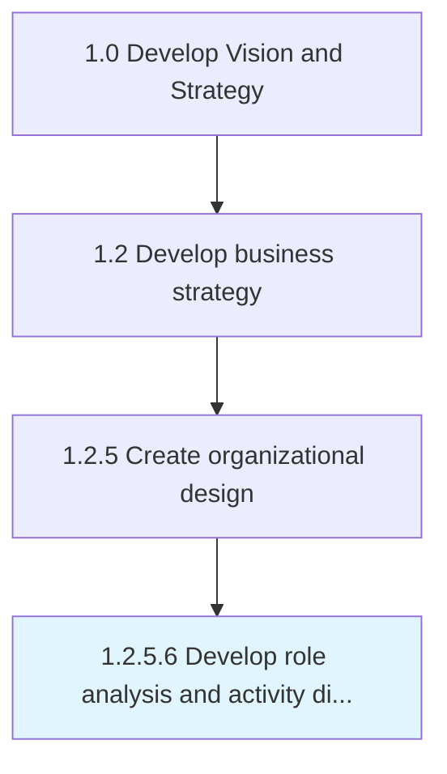

# Develop role analysis and activity diagrams for key processes

> Creating an understanding of the fit between job roles and organizational processes in order to properly place personnel.

## Overview

Activity 1.2.5.6 is an activity within the Develop Vision and Strategy framework. 

Creating an understanding of the fit between job roles and organizational processes in order to properly place personnel. Deconstruct key processes into constituent activities, and examine job-related roles. Take cues from Develop role activity diagrams to assess hand-off activity [10051]. Map appropriate positions against these important processes, which in turn expedite the deployment of staff members.

## Process Hierarchy



## Key Statistics

| Metric | Value |
|--------|-------|
| APQC Code | 10054 |
| Hierarchy ID | 1.2.5.6 |
| Level | Activity |
| Parent | [1.2.5](../) |
| Sub-Processes | 0 |


## GraphDL Semantic Structure

```
develop.RoleAnalysisAndActivityDiagrams.for.KeyProcesses
```

| Component | Value | Description |
|-----------|-------|-------------|
| Verb | `develop` | Primary action |
| Object | `role analysis and activity diagrams` | Direct object |
| Preposition | `for` | Relationship |
| PrepObject | `key processes` | Indirect object |


## Related Concepts

- RoleAnalysisDiagrams
- KeyProcesses
- ActivityDiagrams
- KeyProcesses


---

*Source: APQC PCF 10054 (1.2.5.6) - APQC*
