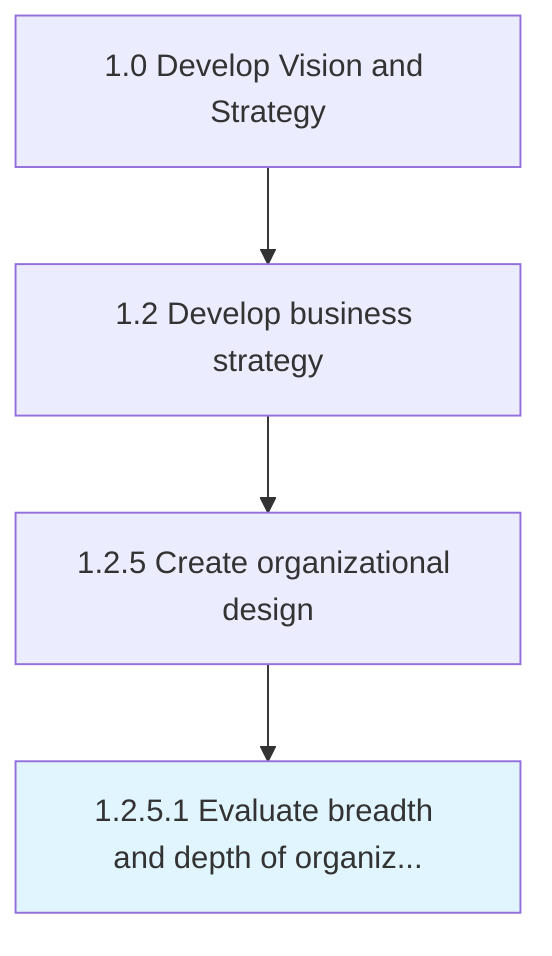
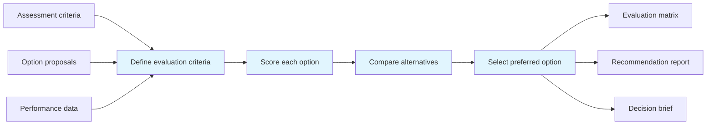
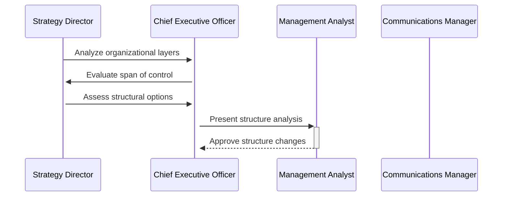

# Evaluate breadth and depth of organizational structure

> Evaluating the structural makeup of the organization, including pertinent features of and associated synergies among constituent elements.

## Overview

Activity 1.2.5.1 is an activity within the Develop Vision and Strategy framework. 

Evaluating the structural makeup of the organization, including pertinent features of and associated synergies among constituent elements. Examine the organization's architectural framework, paying close attention to the individual elements, the relations among them, and the conjoint and co-acting forces therein. Analyze functions and processes, as well as work-related positions. Scrutinize various relevant characteristics associated with each of them, depending upon the scale, scope, and type of organization.

This process plays a critical role within the broader "Develop Vision and Strategy" capability area (APQC Category 1.0). By systematically executing this activity, organizations ensure that strategic decisions are grounded in thorough analysis and aligned with overall business objectives. The outputs of this process feed into downstream strategy development and execution activities, creating a foundation for informed decision-making across the enterprise.

## Process Hierarchy



## Key Statistics

| Metric | Value |
|--------|-------|
| APQC Code | 10049 |
| Hierarchy ID | 1.2.5.1 |
| Level | Activity |
| Parent | [1.2.5](../) |
| Sub-Processes | 0 |
| Estimated Duration | 1-4 weeks |
| Complexity | Medium |

## GraphDL Semantic Structure

```graphdl
evaluate.BreadthAndDepth.of.OrganizationalStructure
```

| Component | Value | Description |
|-----------|-------|-------------|
| Verb | `evaluate` | Primary action |
| Object | `breadth and depth` | Direct object |
| Preposition | `of` | Relationship |
| PrepObject | `organizational structure` | Indirect object |

## Process Flow



## Process Sequence



## RACI Matrix

| Activity | Responsible | Accountable | Consulted | Informed |
|----------|-------------|-------------|-----------|----------|
| Define strategic framework | Strategy Director | Chief Executive Officer | Business Unit Leaders | All Employees |
| Develop strategy components | Management Analyst | Strategy Director | Functional Leaders | Department Heads |
| Review and validate | Strategy Director | Chief Executive Officer | External Advisors | Board of Directors |
| Communicate and deploy | Communications Manager | Chief Executive Officer | Strategy Team | All Stakeholders |

## Related Occupations

| Occupation | Role in Process |
|------------|----------------|
| [Chief Executives](/occupations/Management/ChiefExecutives) | Primary strategic oversight and decision authority |
| [General and Operations Managers](/occupations/Management/GeneralAndOperationsManagers) | Executes analysis and produces deliverables |
| [Management Analysts](/occupations/Business/Operations/ManagementAnalysts) | Provides analytical frameworks and recommendations |
| [Industrial-Organizational Psychologists](/occupations/Science/IndustrialOrganizationalPsychologists) | Supports data gathering and insight generation |
| [Strategic Planners](/occupations/StrategicPlanners) | Coordinates strategic alignment and planning |

## Related Departments

| Department | Involvement |
|------------|-------------|
| Strategy & Planning | Primary owner and executor of this process |
| [Operations](/departments/Operations) | Provides supporting data, resources, and coordination |
| Executive Leadership | Provides governance, approval, and strategic direction |

## Industry Variations

| Industry | Variation | Reference |
|----------|-----------|-----------|
| Manufacturing | Emphasizes supply chain and operational efficiency metrics in strategic planning | [manufacturing](/industries/manufacturing) |
| Financial Services | Focuses on regulatory compliance and risk management within strategy processes | [banking](/industries/banking) |
| Technology | Prioritizes innovation velocity and digital transformation in strategic initiatives | [consumer-electronics](/industries/consumer-electronics) |

## KPIs & Metrics

| KPI | Description | Target |
|-----|-------------|--------|
| Evaluation Thoroughness | Percentage of criteria assessed per option | 100% |
| Decision Quality | Post-decision success rate | > 75% |
| Time to Decision | Average time from evaluation start to recommendation | < 4 weeks |

## Related Concepts

- Breadth
- OrganizationalStructure
- Depth
- OrganizationalStructure

---

*Source: APQC PCF 10049 (1.2.5.1) - APQC*
