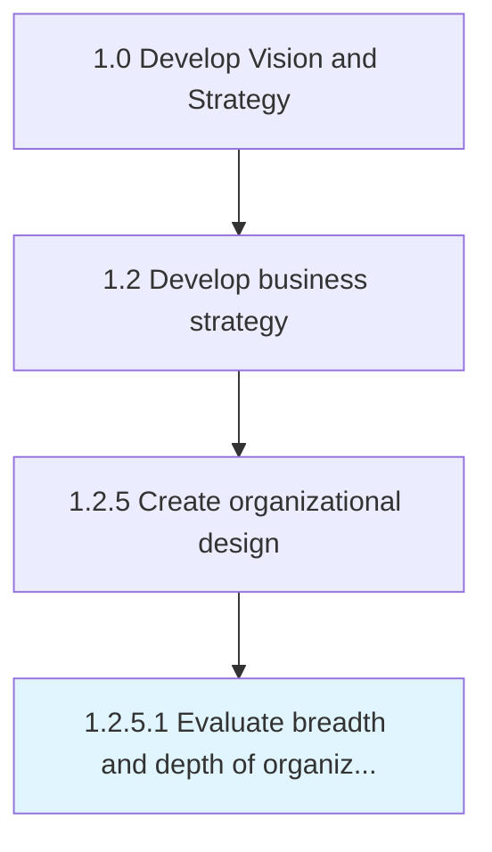

# Evaluate breadth and depth of organizational structure

> Evaluating the structural makeup of the organization, including pertinent features of and associated synergies among constituent elements.

## Overview

Activity 1.2.5.1 is an activity within the Develop Vision and Strategy framework. 

Evaluating the structural makeup of the organization, including pertinent features of and associated synergies among constituent elements. Examine the organization's architectural framework, paying close attention to the individual elements, the relations among them, and the conjoint and co-acting forces therein. Analyze functions and processes, as well as work-related positions. Scrutinize various relevant characteristics associated with each of them, depending upon the scale, scope, and type of organization.

## Process Hierarchy



## Key Statistics

| Metric | Value |
|--------|-------|
| APQC Code | 10049 |
| Hierarchy ID | 1.2.5.1 |
| Level | Activity |
| Parent | [1.2.5](../) |
| Sub-Processes | 0 |


## GraphDL Semantic Structure

```
evaluate.BreadthAndDepth.of.OrganizationalStructure
```

| Component | Value | Description |
|-----------|-------|-------------|
| Verb | `evaluate` | Primary action |
| Object | `breadth and depth` | Direct object |
| Preposition | `of` | Relationship |
| PrepObject | `organizational structure` | Indirect object |


## Related Concepts

- Breadth
- OrganizationalStructure
- Depth
- OrganizationalStructure


---

*Source: APQC PCF 10049 (1.2.5.1) - APQC*
