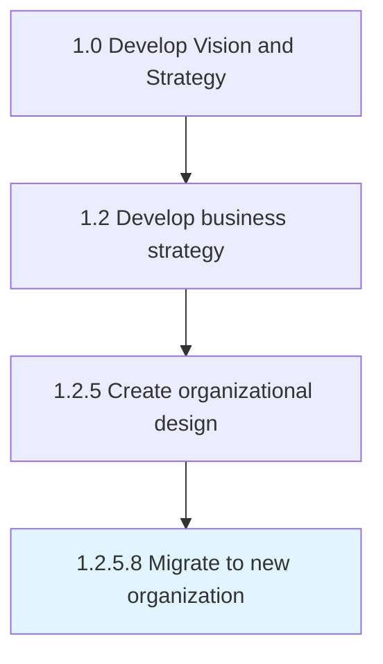

# Migrate to new organization

> Embracing and ratifying a new organizational structure.

## Overview

Activity 1.2.5.8 is an activity within the Develop Vision and Strategy framework. 

Embracing and ratifying a new organizational structure. (Assume the new framework to be the best fit through Assess the organizational implications of feasible alternatives [10055].)

## Process Hierarchy



## Key Statistics

| Metric | Value |
|--------|-------|
| APQC Code | 10056 |
| Hierarchy ID | 1.2.5.8 |
| Level | Activity |
| Parent | [1.2.5](../) |
| Sub-Processes | 0 |


## GraphDL Semantic Structure

```
migrate.ToNewOrganization
```

| Component | Value | Description |
|-----------|-------|-------------|
| Verb | `migrate` | Primary action |
| Object | `to new organization` | Direct object |


## Related Concepts

- NewOrganization


---

*Source: APQC PCF 10056 (1.2.5.8) - APQC*
