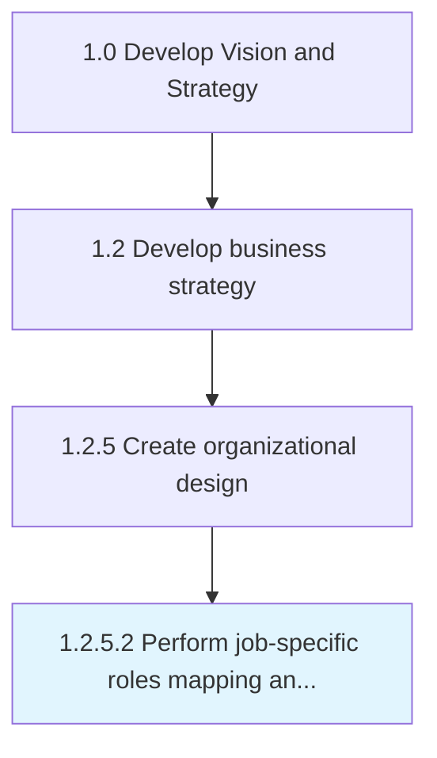

# Perform job-specific roles mapping and value-added analyses

> Appraising job-specific roles within the organizational chart and their hierarchical architecture.

## Overview

Activity 1.2.5.2 is an activity within the Develop Vision and Strategy framework. 

Appraising job-specific roles within the organizational chart and their hierarchical architecture. Analyze a map of work-related roles within the organizational structure. Examine the value added by the positions associated with jobs to be performed and how they stack up within the organization's operations.

## Process Hierarchy



## Key Statistics

| Metric | Value |
|--------|-------|
| APQC Code | 10050 |
| Hierarchy ID | 1.2.5.2 |
| Level | Activity |
| Parent | [1.2.5](../) |
| Sub-Processes | 0 |


## GraphDL Semantic Structure

```
perform.JobspecificRolesMappingAndValueaddedAnalyses
```

| Component | Value | Description |
|-----------|-------|-------------|
| Verb | `perform` | Primary action |
| Object | `job-specific roles mapping and value-added analyses` | Direct object |


---

*Source: APQC PCF 10050 (1.2.5.2) - APQC*
