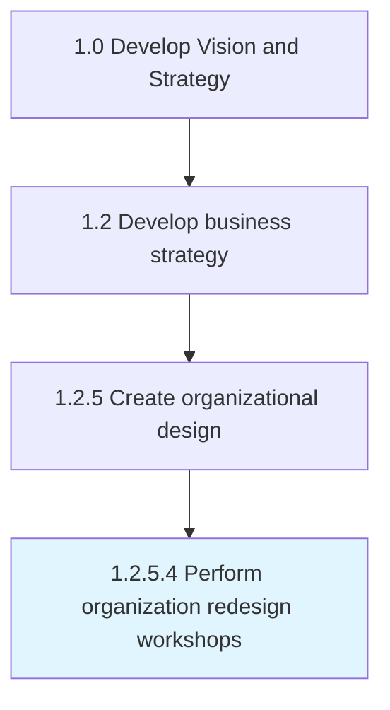

# Perform organization redesign workshops

> Organizing workshop sessions to adopt organizational redesign.

## Overview

Activity 1.2.5.4 is an activity within the Develop Vision and Strategy framework. 

Organizing workshop sessions to adopt organizational redesign. Communicate the organizational structure and mapping of responsibilities against job roles in order to facilitate an effective understanding among personnel. Use a collaborative process that may include participative workshop sessions.

## Process Hierarchy



## Key Statistics

| Metric | Value |
|--------|-------|
| APQC Code | 10052 |
| Hierarchy ID | 1.2.5.4 |
| Level | Activity |
| Parent | [1.2.5](../) |
| Sub-Processes | 0 |


## GraphDL Semantic Structure

```
perform.OrganizationRedesignWorkshops
```

| Component | Value | Description |
|-----------|-------|-------------|
| Verb | `perform` | Primary action |
| Object | `organization redesign workshops` | Direct object |


## Related Concepts

- [OrganizationRedesignWorkshops](/concepts/OrganizationRedesignWorkshops)


---

*Source: APQC PCF 10052 (1.2.5.4) - APQC*
