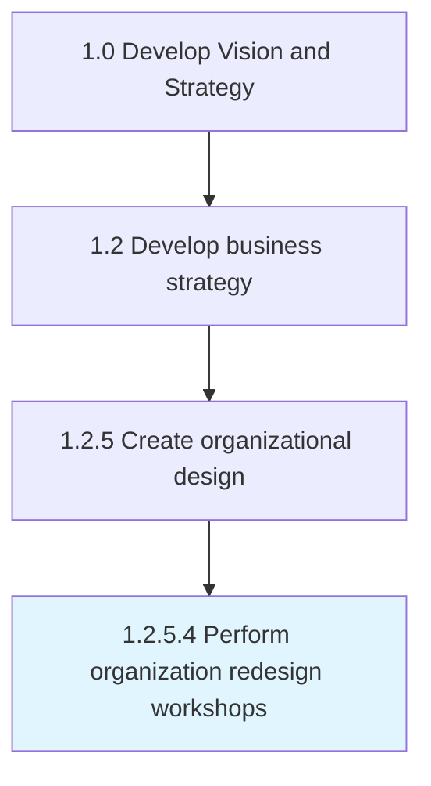
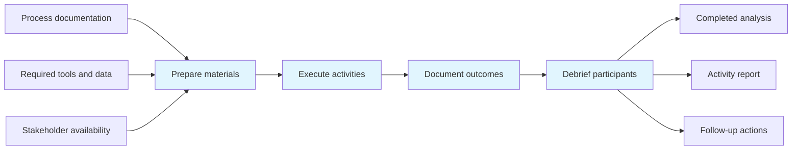

# Perform organization redesign workshops

> Organizing workshop sessions to adopt organizational redesign.

## Overview

Activity 1.2.5.4 is an activity within the Develop Vision and Strategy framework. 

Organizing workshop sessions to adopt organizational redesign. Communicate the organizational structure and mapping of responsibilities against job roles in order to facilitate an effective understanding among personnel. Use a collaborative process that may include participative workshop sessions.

This process plays a critical role within the broader "Develop Vision and Strategy" capability area (APQC Category 1.0). By systematically executing this activity, organizations ensure that strategic decisions are grounded in thorough analysis and aligned with overall business objectives. The outputs of this process feed into downstream strategy development and execution activities, creating a foundation for informed decision-making across the enterprise.

## Process Hierarchy



## Key Statistics

| Metric | Value |
|--------|-------|
| APQC Code | 10052 |
| Hierarchy ID | 1.2.5.4 |
| Level | Activity |
| Parent | [1.2.5](../) |
| Sub-Processes | 0 |
| Estimated Duration | 1-4 weeks |
| Complexity | Medium |

## GraphDL Semantic Structure

```
perform.OrganizationRedesignWorkshops
```

| Component | Value | Description |
|-----------|-------|-------------|
| Verb | `perform` | Primary action |
| Object | `organization redesign workshops` | Direct object |

## Process Flow



## RACI Matrix

| Activity | Responsible | Accountable | Consulted | Informed |
|----------|-------------|-------------|-----------|----------|
| Define strategic framework | Strategy Director | Chief Executive Officer | Business Unit Leaders | All Employees |
| Develop strategy components | Management Analyst | Strategy Director | Functional Leaders | Department Heads |
| Review and validate | Strategy Director | Chief Executive Officer | External Advisors | Board of Directors |
| Communicate and deploy | Communications Manager | Chief Executive Officer | Strategy Team | All Stakeholders |

## Related Occupations

| Occupation | Role in Process |
|------------|----------------|
| [Chief Executives](/occupations/ChiefExecutives) | Primary strategic oversight and decision authority |
| [General and Operations Managers](/occupations/GeneralAndOperationsManagers) | Executes analysis and produces deliverables |
| [Management Analysts](/occupations/ManagementAnalysts) | Provides analytical frameworks and recommendations |
| [Industrial-Organizational Psychologists](/occupations/IndustrialOrganizationalPsychologists) | Supports data gathering and insight generation |
| [Strategic Planners](/occupations/StrategicPlanners) | Coordinates strategic alignment and planning |

## Related Departments

| Department | Involvement |
|------------|-------------|
| [Strategy & Planning](/departments/StrategyAndPlanning) | Primary owner and executor of this process |
| [Operations](/departments/Operations) | Provides supporting data, resources, and coordination |
| [Executive Leadership](/departments/ExecutiveLeadership) | Provides governance, approval, and strategic direction |

## Industry Variations

| Industry | Variation | Reference |
|----------|-----------|-----------|
| Manufacturing | Emphasizes supply chain and operational efficiency metrics in strategic planning | [manufacturing](/industries/manufacturing) |
| Financial Services | Focuses on regulatory compliance and risk management within strategy processes | [banking](/industries/banking) |
| Technology | Prioritizes innovation velocity and digital transformation in strategic initiatives | [consumer-electronics](/industries/consumer-electronics) |

## KPIs & Metrics

| KPI | Description | Target |
|-----|-------------|--------|
| Process Completion Rate | Percentage of process completed on schedule | > 95% |
| Stakeholder Satisfaction | Average satisfaction rating from involved parties | > 4.0/5.0 |
| Output Quality Score | Quality assessment of process deliverables | > 80% |

## Related Concepts

- OrganizationRedesignWorkshops

---

*Source: APQC PCF 10052 (1.2.5.4) - APQC*
