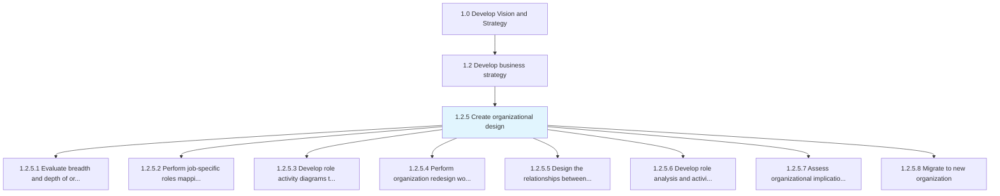
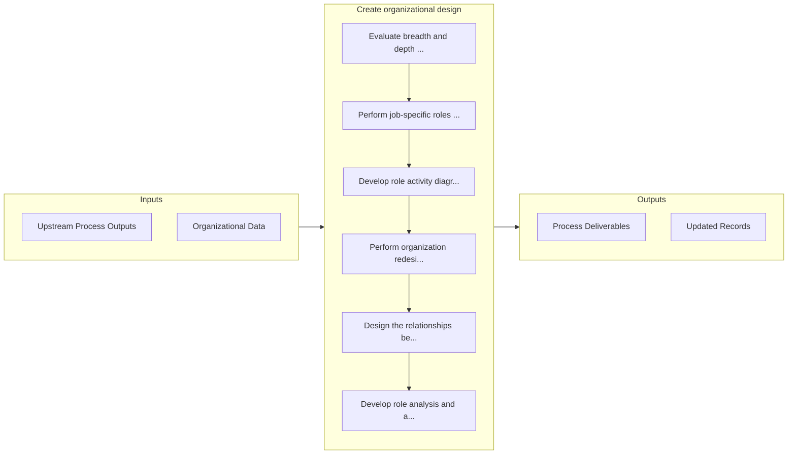

# Create organizational design

> Formulating a design for the organization's resources that allow it to meet its objectives.

## Overview

Process 1.2.5 is a core process that defines the specific procedures for create organizational design. 

Formulating a design for the organization's resources that allow it to meet its objectives. Develop a new framework for molding the organization's various processes into a coherent and seamless whole.

## Process Hierarchy



## Key Statistics

| Metric | Value |
|--------|-------|
| APQC Code | 10041 |
| Hierarchy ID | 1.2.5 |
| Level | Process |
| Parent | [1.2](../) |
| Sub-Processes | 8 |


## GraphDL Semantic Structure

```
create.OrganizationalDesign
```

| Component | Value | Description |
|-----------|-------|-------------|
| Verb | `create` | Primary action |
| Object | `organizational design` | Direct object |


## Process Flow



## Sub-Processes

| Process | Hierarchy ID | Description |
|---------|-------------|-------------|
| [Evaluate breadth and depth of organizational structure](./EvaluateBreadthAndDepthOfOrganizationalStructure) | 1.2.5.1 | Evaluating the structural makeup of the organization, including pertinent features of and associated |
| [Perform job-specific roles mapping and value-added analyses](./PerformJobspecificRolesMappingAndValueaddedAnalyses) | 1.2.5.2 | Appraising job-specific roles within the organizational chart and their hierarchical architecture |
| [Develop role activity diagrams to assess hand-off activity](./DevelopRoleActivityDiagramsToAssessHandoffActivity) | 1.2.5.3 | Examining the constituent exercises and undertakings within a work-related position for the purpose  |
| [Perform organization redesign workshops](./PerformOrganizationRedesignWorkshops) | 1.2.5.4 | Organizing workshop sessions to adopt organizational redesign |
| [Design the relationships between organizational units](./DesignTheRelationshipsBetweenOrganizationalUnits) | 1.2.5.5 | Fleshing out the connections and dependencies among the various units of the organization |
| [Develop role analysis and activity diagrams for key processes](./DevelopRoleAnalysisAndActivityDiagramsForKeyProcesses) | 1.2.5.6 | Creating an understanding of the fit between job roles and organizational processes in order to prop |
| [Assess organizational implication of feasible alternatives](./AssessOrganizationalImplicationOfFeasibleAlternatives) | 1.2.5.7 | Probing the repercussions of all practicable organizational design options |
| [Migrate to new organization](./MigrateToNewOrganization) | 1.2.5.8 | Embracing and ratifying a new organizational structure |


## Related Concepts

- [OrganizationalDesign](/concepts/OrganizationalDesign)


---

*Source: APQC PCF 10041 (1.2.5) - APQC*
