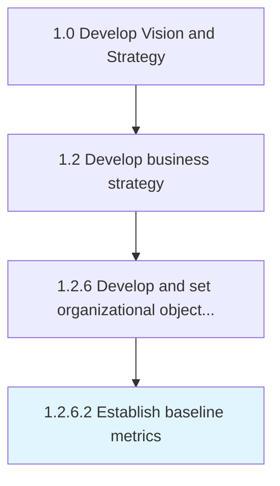

# Establish baseline metrics

> Establishing baselines that provide standards for assessing performance.

## Overview

Activity 1.2.6.2 is an activity within the Develop Vision and Strategy framework. 

Establishing baselines that provide standards for assessing performance. Create metrics and KPI's for various functions/processes/activities based on organizational goals.

## Process Hierarchy



## Key Statistics

| Metric | Value |
|--------|-------|
| APQC Code | 19954 |
| Hierarchy ID | 1.2.6.2 |
| Level | Activity |
| Parent | [1.2.6](../) |
| Sub-Processes | 0 |


## GraphDL Semantic Structure

```
establish.BaselineMetrics
```

| Component | Value | Description |
|-----------|-------|-------------|
| Verb | `establish` | Primary action |
| Object | `baseline metrics` | Direct object |


## Related Concepts

- [BaselineMetrics](/concepts/BaselineMetrics)


---

*Source: APQC PCF 19954 (1.2.6.2) - APQC*
