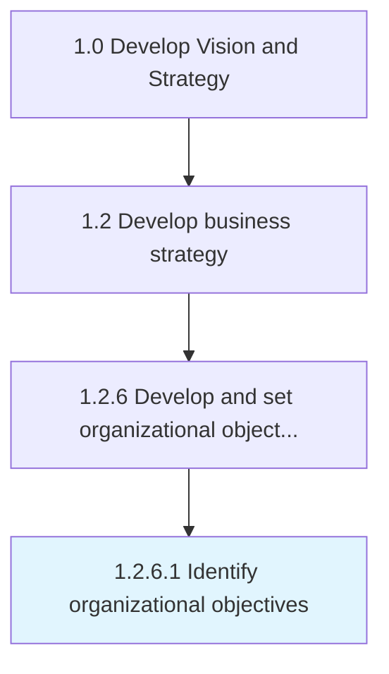

# Identify organizational objectives

> Creating and developing strategic objectives that establishes a process to outline expected outcomes and guide employees' efforts.

## Overview

Activity 1.2.6.1 is an activity within the Develop Vision and Strategy framework. 

Creating and developing strategic objectives that establishes a process to outline expected outcomes and guide employees' efforts.

## Process Hierarchy



## Key Statistics

| Metric | Value |
|--------|-------|
| APQC Code | 19953 |
| Hierarchy ID | 1.2.6.1 |
| Level | Activity |
| Parent | [1.2.6](../) |
| Sub-Processes | 0 |


## GraphDL Semantic Structure

```
identify.OrganizationalObjectives
```

| Component | Value | Description |
|-----------|-------|-------------|
| Verb | `identify` | Primary action |
| Object | `organizational objectives` | Direct object |


## Related Concepts

- OrganizationalObjectives


---

*Source: APQC PCF 19953 (1.2.6.1) - APQC*
