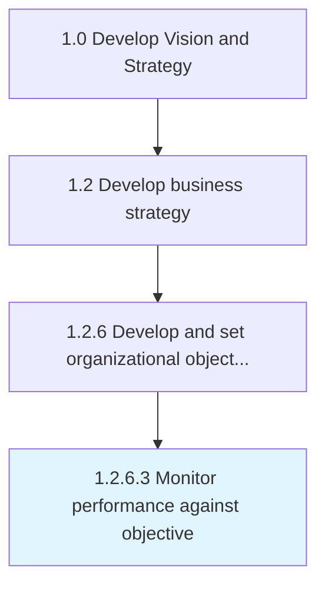

# Monitor performance against objective

> Defining methodology and frequency of assessment for measuring and monitoring performance of various functions/processes/activities against standard set goals.

## Overview

Activity 1.2.6.3 is an activity within the Develop Vision and Strategy framework. 

Defining methodology and frequency of assessment for measuring and monitoring performance of various functions/processes/activities against standard set goals.

## Process Hierarchy



## Key Statistics

| Metric | Value |
|--------|-------|
| APQC Code | 19955 |
| Hierarchy ID | 1.2.6.3 |
| Level | Activity |
| Parent | [1.2.6](../) |
| Sub-Processes | 0 |


## GraphDL Semantic Structure

```
monitor.Performance.against.Objective
```

| Component | Value | Description |
|-----------|-------|-------------|
| Verb | `monitor` | Primary action |
| Object | `performance` | Direct object |
| Preposition | `against` | Relationship |
| PrepObject | `objective` | Indirect object |


## Related Concepts

- Performance
- Objective


---

*Source: APQC PCF 19955 (1.2.6.3) - APQC*
