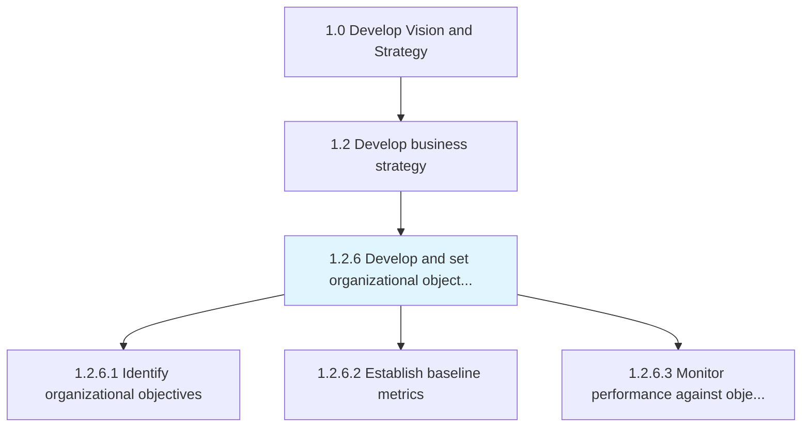
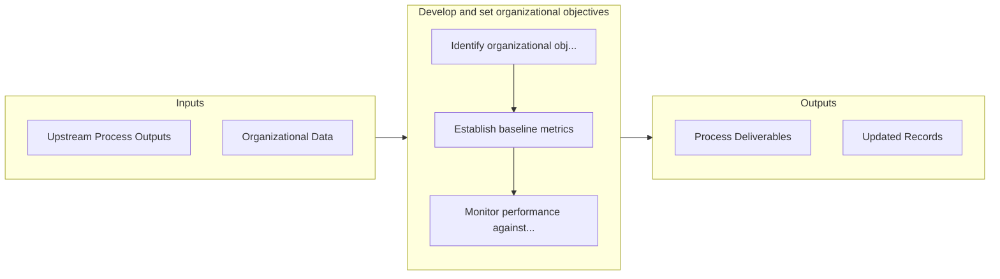

# Develop and set organizational objectives

> Developing overall goals for the organization that help in accomplishing its mission.

## Overview

Process 1.2.6 is a core process that defines the specific procedures for develop and set organizational objectives. 

Developing overall goals for the organization that help in accomplishing its mission. Formulate organization-wide targets in the near to middle term, which will accumulate and propel the organization to realize its long-term objectives, as outlined in Develop an overall mission statement [10037]. Enlist business unit heads or equivalent personnel, in close collaboration with senior management executives.

## Process Hierarchy



## Key Statistics

| Metric | Value |
|--------|-------|
| APQC Code | 10042 |
| Hierarchy ID | 1.2.6 |
| Level | Process |
| Parent | [1.2](../) |
| Sub-Processes | 3 |


## GraphDL Semantic Structure

```
develop.AndSetOrganizationalObjectives
```

| Component | Value | Description |
|-----------|-------|-------------|
| Verb | `develop` | Primary action |
| Object | `and set organizational objectives` | Direct object |


## Process Flow



## Sub-Processes

| Process | Hierarchy ID | Description |
|---------|-------------|-------------|
| [Identify organizational objectives](./IdentifyOrganizationalObjectives) | 1.2.6.1 | Creating and developing strategic objectives that establishes a process to outline expected outcomes |
| [Establish baseline metrics](./EstablishBaselineMetrics) | 1.2.6.2 | Establishing baselines that provide standards for assessing performance |
| [Monitor performance against objective](./MonitorPerformanceAgainstObjective) | 1.2.6.3 | Defining methodology and frequency of assessment for measuring and monitoring performance of various |


## Related Concepts

- [OrganizationalObjectives](/concepts/OrganizationalObjectives)
- [OrganizationalObjectives](/concepts/OrganizationalObjectives)


---

*Source: APQC PCF 10042 (1.2.6) - APQC*
