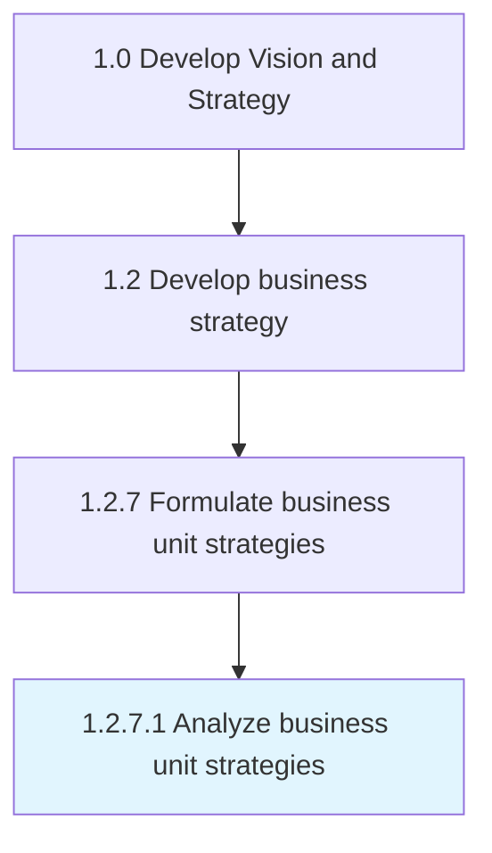

# Analyze business unit strategies

> Assessing the performance of a business unit against set organizational goals which are based on pre-defined metrics collected through various business unit operations.

## Overview

Activity 1.2.7.1 is an activity within the Develop Vision and Strategy framework. 

Assessing the performance of a business unit against set organizational goals which are based on pre-defined metrics collected through various business unit operations.

## Process Hierarchy



## Key Statistics

| Metric | Value |
|--------|-------|
| APQC Code | 19956 |
| Hierarchy ID | 1.2.7.1 |
| Level | Activity |
| Parent | [1.2.7](../) |
| Sub-Processes | 0 |


## GraphDL Semantic Structure

```
analyze.BusinessUnitStrategies
```

| Component | Value | Description |
|-----------|-------|-------------|
| Verb | `analyze` | Primary action |
| Object | `business unit strategies` | Direct object |


## Related Concepts

- [BusinessUnitStrategies](/concepts/BusinessUnitStrategies)


---

*Source: APQC PCF 19956 (1.2.7.1) - APQC*
