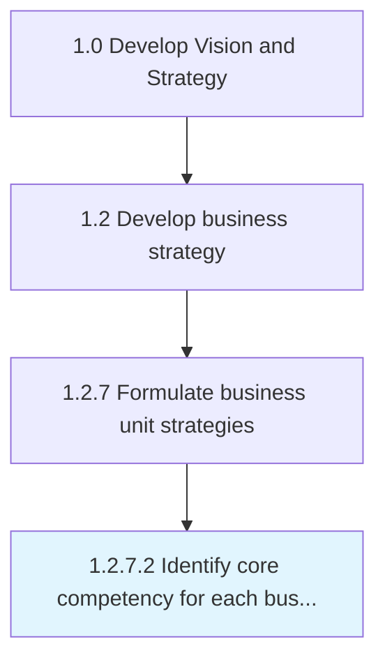

# Identify core competency for each business unit

> Determining the resources and skills of each business unit based on knowledge and technical capacity.

## Overview

Activity 1.2.7.2 is an activity within the Develop Vision and Strategy framework. 

Determining the resources and skills of each business unit based on knowledge and technical capacity. Enable business units to meet customer needs and grow in a competitive marketplace.

## Process Hierarchy



## Key Statistics

| Metric | Value |
|--------|-------|
| APQC Code | 19957 |
| Hierarchy ID | 1.2.7.2 |
| Level | Activity |
| Parent | [1.2.7](../) |
| Sub-Processes | 0 |


## GraphDL Semantic Structure

```
identify.CoreCompetency.for.EachBusinessUnit
```

| Component | Value | Description |
|-----------|-------|-------------|
| Verb | `identify` | Primary action |
| Object | `core competency` | Direct object |
| Preposition | `for` | Relationship |
| PrepObject | `each business unit` | Indirect object |


## Related Concepts

- [CoreCompetency](/concepts/CoreCompetency)
- [BusinessUnit](/concepts/BusinessUnit)


---

*Source: APQC PCF 19957 (1.2.7.2) - APQC*
