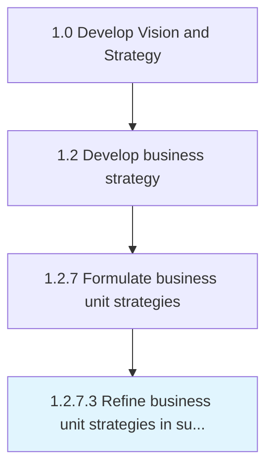

# Refine business unit strategies in support of organizational strategy

> Evaluating existing business unit strategy based on the company's strategy and eliminate unwanted/unnecessary resources/elements and re-consider necessary resources to meet the overall company's strategy.

## Overview

Activity 1.2.7.3 is an activity within the Develop Vision and Strategy framework. 

Evaluating existing business unit strategy based on the company's strategy and eliminate unwanted/unnecessary resources/elements and re-consider necessary resources to meet the overall company's strategy.

## Process Hierarchy



## Key Statistics

| Metric | Value |
|--------|-------|
| APQC Code | 19958 |
| Hierarchy ID | 1.2.7.3 |
| Level | Activity |
| Parent | [1.2.7](../) |
| Sub-Processes | 0 |


## GraphDL Semantic Structure

```
refine.BusinessUnitStrategies.in.SupportOfOrganizationalStrategy
```

| Component | Value | Description |
|-----------|-------|-------------|
| Verb | `refine` | Primary action |
| Object | `business unit strategies` | Direct object |
| Preposition | `in` | Relationship |
| PrepObject | `support of organizational strategy` | Indirect object |


## Related Concepts

- [BusinessUnitStrategies](/concepts/BusinessUnitStrategies)
- [SupportOfOrganizationalStrategy](/concepts/SupportOfOrganizationalStrategy)


---

*Source: APQC PCF 19958 (1.2.7.3) - APQC*
