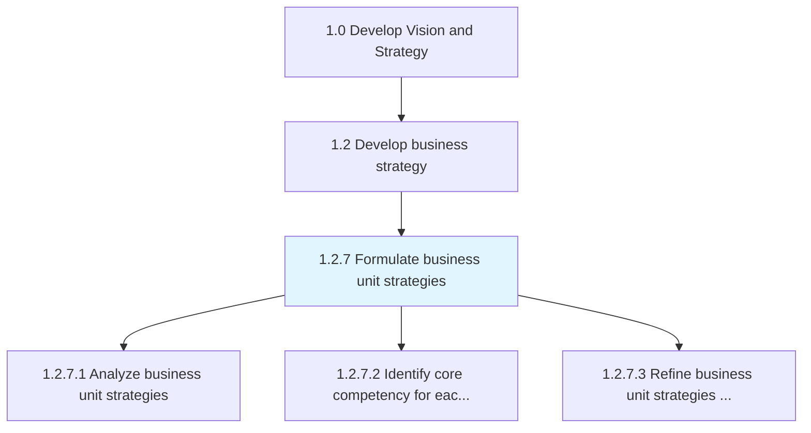
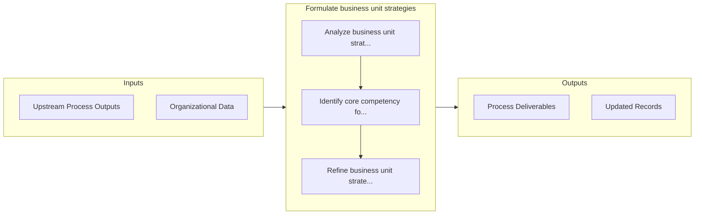

# Formulate business unit strategies

> Charting a strategic course for business units in order to leverage opportunities, sidestep hurdles, and create synergies among each other.

## Overview

Process 1.2.7 is a core process that defines the specific procedures for formulate business unit strategies. 

Charting a strategic course for business units in order to leverage opportunities, sidestep hurdles, and create synergies among each other. Create strategic road maps for the organization's units--in light of their individual resources and requirements, as well as their relationships with other business units--to achieve organizational goals.

## Process Hierarchy



## Key Statistics

| Metric | Value |
|--------|-------|
| APQC Code | 10043 |
| Hierarchy ID | 1.2.7 |
| Level | Process |
| Parent | [1.2](../) |
| Sub-Processes | 3 |


## GraphDL Semantic Structure

```
formulate.BusinessUnitStrategies
```

| Component | Value | Description |
|-----------|-------|-------------|
| Verb | `formulate` | Primary action |
| Object | `business unit strategies` | Direct object |


## Process Flow



## Sub-Processes

| Process | Hierarchy ID | Description |
|---------|-------------|-------------|
| [Analyze business unit strategies](./AnalyzeBusinessUnitStrategies) | 1.2.7.1 | Assessing the performance of a business unit against set organizational goals which are based on pre |
| [Identify core competency for each business unit](./IdentifyCoreCompetencyForEachBusinessUnit) | 1.2.7.2 | Determining the resources and skills of each business unit based on knowledge and technical capacity |
| [Refine business unit strategies in support of organizational strategy](./RefineBusinessUnitStrategiesInSupportOfOrganizationalStrategy) | 1.2.7.3 | Evaluating existing business unit strategy based on the company's strategy and eliminate unwanted/un |


## Related Concepts

- BusinessUnitStrategies


---

*Source: APQC PCF 10043 (1.2.7) - APQC*
