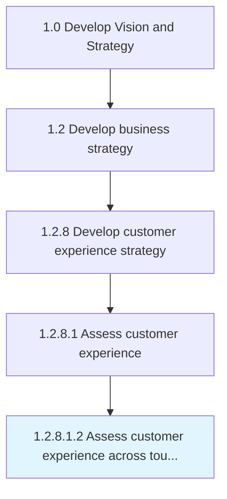

# Assess customer experience across touchpoints

> Evaluating customer experiences, expectations, and suggestions in both liked and disliked areas of the product or services.

## Overview

Sub-Activity 1.2.8.1.2 is an activity within the Develop Vision and Strategy framework. 

Evaluating customer experiences, expectations, and suggestions in both liked and disliked areas of the product or services. Analyze all modes of communication, human and physical interactions, or customers experience during the relationship lifecycle with your organization. Evaluate the gaps/further development/alterations to the existing product/service to attain better customer response.

## Process Hierarchy



## Key Statistics

| Metric | Value |
|--------|-------|
| APQC Code | 19962 |
| Hierarchy ID | 1.2.8.1.2 |
| Level | Sub-Activity |
| Parent | [1.2.8.1](../) |
| Sub-Processes | 0 |


## GraphDL Semantic Structure

```
assess.CustomerExperience.across.Touchpoints
```

| Component | Value | Description |
|-----------|-------|-------------|
| Verb | `assess` | Primary action |
| Object | `customer experience` | Direct object |
| Preposition | `across` | Relationship |
| PrepObject | `touchpoints` | Indirect object |


## Related Concepts

- CustomerExperience
- Touchpoints


---

*Source: APQC PCF 19962 (1.2.8.1.2) - APQC*
