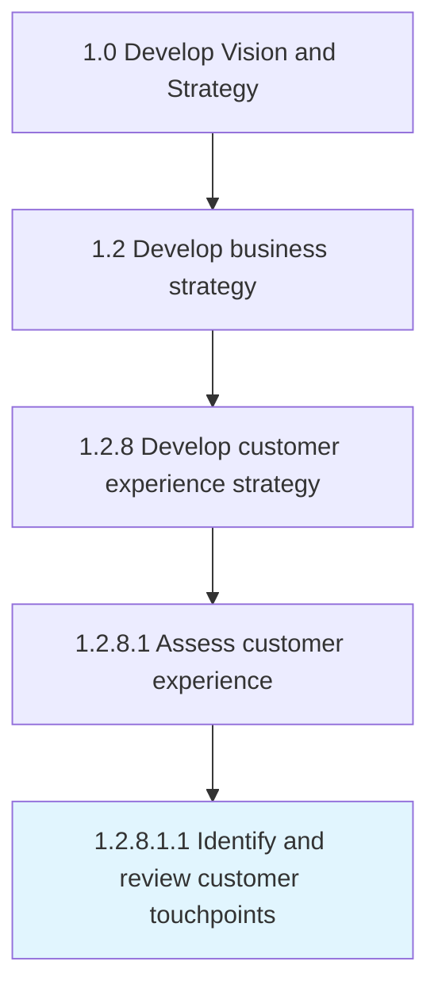

# Identify and review customer touchpoints

> Creating methods to gauge customer experiences, expectations, and suggestions.

## Overview

Sub-Activity 1.2.8.1.1 is an activity within the Develop Vision and Strategy framework. 

Creating methods to gauge customer experiences, expectations, and suggestions. Review both liked and disliked areas of product/services to be delivered. Evaluate touchpoints based on the nature of product/service in the market e.g., billboards, web sites, direct mail, service calls, etc.

## Process Hierarchy



## Key Statistics

| Metric | Value |
|--------|-------|
| APQC Code | 19961 |
| Hierarchy ID | 1.2.8.1.1 |
| Level | Sub-Activity |
| Parent | [1.2.8.1](../) |
| Sub-Processes | 0 |


## GraphDL Semantic Structure

```
identify.AndReviewCustomerTouchpoints
```

| Component | Value | Description |
|-----------|-------|-------------|
| Verb | `identify` | Primary action |
| Object | `and review customer touchpoints` | Direct object |


## Related Concepts

- [CustomerTouchpoints](/concepts/CustomerTouchpoints)
- [CustomerTouchpoints](/concepts/CustomerTouchpoints)


---

*Source: APQC PCF 19961 (1.2.8.1.1) - APQC*
