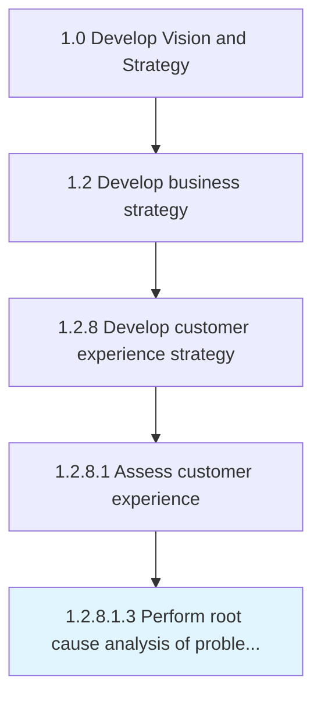

# Perform root cause analysis of problematic customer experiences

> Analyzing the core reason for the customer experience/feedback/response about the product/service to take considerable action for better customer experience.

## Overview

Sub-Activity 1.2.8.1.3 is an activity within the Develop Vision and Strategy framework. 

Analyzing the core reason for the customer experience/feedback/response about the product/service to take considerable action for better customer experience.

## Process Hierarchy



## Key Statistics

| Metric | Value |
|--------|-------|
| APQC Code | 19963 |
| Hierarchy ID | 1.2.8.1.3 |
| Level | Sub-Activity |
| Parent | [1.2.8.1](../) |
| Sub-Processes | 0 |


## GraphDL Semantic Structure

```
perform.RootCauseAnalysis.of.ProblematicCustomerExperiences
```

| Component | Value | Description |
|-----------|-------|-------------|
| Verb | `perform` | Primary action |
| Object | `root cause analysis` | Direct object |
| Preposition | `of` | Relationship |
| PrepObject | `problematic customer experiences` | Indirect object |


## Related Concepts

- RootCauseAnalysis
- ProblematicCustomerExperiences


---

*Source: APQC PCF 19963 (1.2.8.1.3) - APQC*
