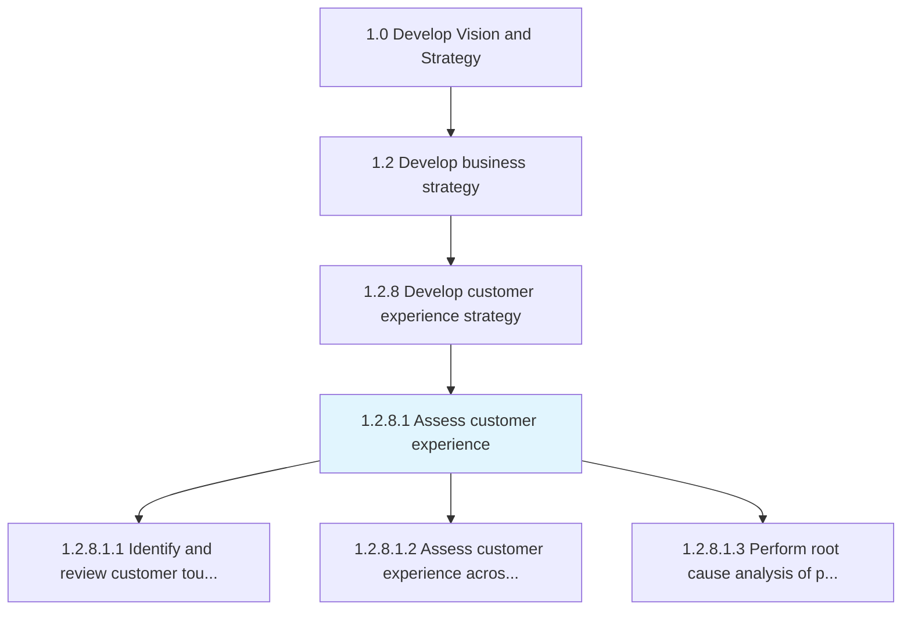
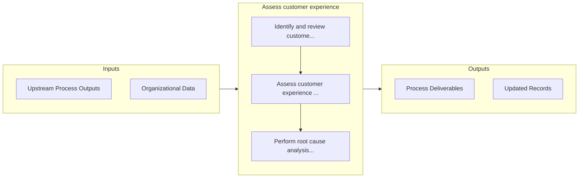

# Assess customer experience

> Measuring customer feedback in regard to product and services effectiveness based on overall satisfaction.

## Overview

Activity 1.2.8.1 is an activity within the Develop Vision and Strategy framework. 

Measuring customer feedback in regard to product and services effectiveness based on overall satisfaction. The data to be analyzed is collected through surveys, customer responses, and feedbacks based on the delivered products/services.

## Process Hierarchy



## Key Statistics

| Metric | Value |
|--------|-------|
| APQC Code | 19960 |
| Hierarchy ID | 1.2.8.1 |
| Level | Activity |
| Parent | [1.2.8](../) |
| Sub-Processes | 3 |


## GraphDL Semantic Structure

```
assess.CustomerExperience
```

| Component | Value | Description |
|-----------|-------|-------------|
| Verb | `assess` | Primary action |
| Object | `customer experience` | Direct object |


## Process Flow



## Sub-Processes

| Process | Hierarchy ID | Description |
|---------|-------------|-------------|
| [Identify and review customer touchpoints](./IdentifyAndReviewCustomerTouchpoints) | 1.2.8.1.1 | Creating methods to gauge customer experiences, expectations, and suggestions |
| [Assess customer experience across touchpoints](./AssessCustomerExperienceAcrossTouchpoints) | 1.2.8.1.2 | Evaluating customer experiences, expectations, and suggestions in both liked and disliked areas of t |
| [Perform root cause analysis of problematic customer experiences](./PerformRootCauseAnalysisOfProblematicCustomerExperiences) | 1.2.8.1.3 | Analyzing the core reason for the customer experience/feedback/response about the product/service to |


## Related Concepts

- CustomerExperience


---

*Source: APQC PCF 19960 (1.2.8.1) - APQC*
