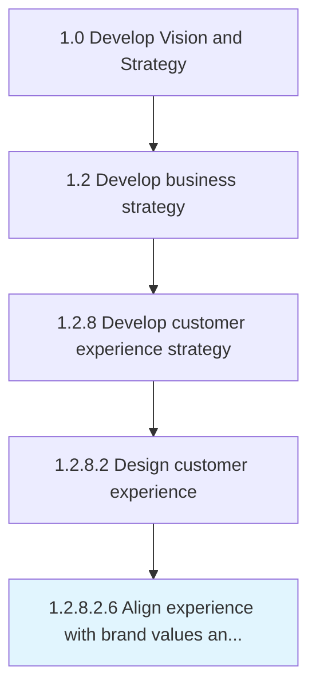

# Align experience with brand values and business strategies

> Aligning and defining a relevant, differentiated, and credible value proposition for the brand.

## Overview

Sub-Activity 1.2.8.2.6 is an activity within the Develop Vision and Strategy framework. 

Aligning and defining a relevant, differentiated, and credible value proposition for the brand. Align experience to ensure that the product and service quality is consistent with brand promise and business strategies.

## Process Hierarchy



## Key Statistics

| Metric | Value |
|--------|-------|
| APQC Code | 19969 |
| Hierarchy ID | 1.2.8.2.6 |
| Level | Sub-Activity |
| Parent | [1.2.8.2](../) |
| Sub-Processes | 0 |


## GraphDL Semantic Structure

```
align.Experience.with.BrandValuesAndBusinessStrategies
```

| Component | Value | Description |
|-----------|-------|-------------|
| Verb | `align` | Primary action |
| Object | `experience` | Direct object |
| Preposition | `with` | Relationship |
| PrepObject | `brand values and business strategies` | Indirect object |


## Related Concepts

- Experience
- BrandValuesStrategies
- Experience
- BusinessStrategies


---

*Source: APQC PCF 19969 (1.2.8.2.6) - APQC*
