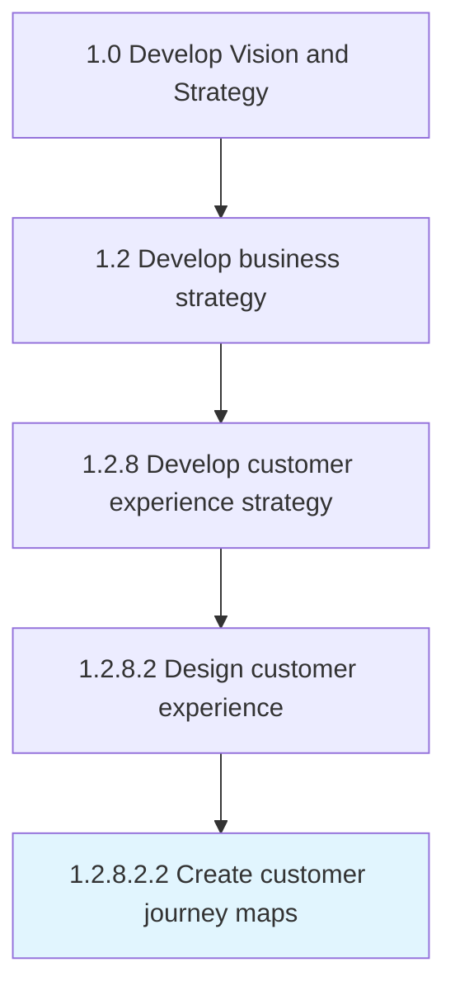

# Create customer journey maps

> Creating a story of the customer's experience: from initial contact, through the process of engagement and into a long-term relationship.

## Overview

Sub-Activity 1.2.8.2.2 is an activity within the Develop Vision and Strategy framework. 

Creating a story of the customer's experience: from initial contact, through the process of engagement and into a long-term relationship. The goal is to teach organization about the customer.

## Process Hierarchy



## Key Statistics

| Metric | Value |
|--------|-------|
| APQC Code | 19965 |
| Hierarchy ID | 1.2.8.2.2 |
| Level | Sub-Activity |
| Parent | [1.2.8.2](../) |
| Sub-Processes | 0 |


## GraphDL Semantic Structure

```
create.CustomerJourneyMaps
```

| Component | Value | Description |
|-----------|-------|-------------|
| Verb | `create` | Primary action |
| Object | `customer journey maps` | Direct object |


## Related Concepts

- [CustomerJourneyMaps](/concepts/CustomerJourneyMaps)


---

*Source: APQC PCF 19965 (1.2.8.2.2) - APQC*
