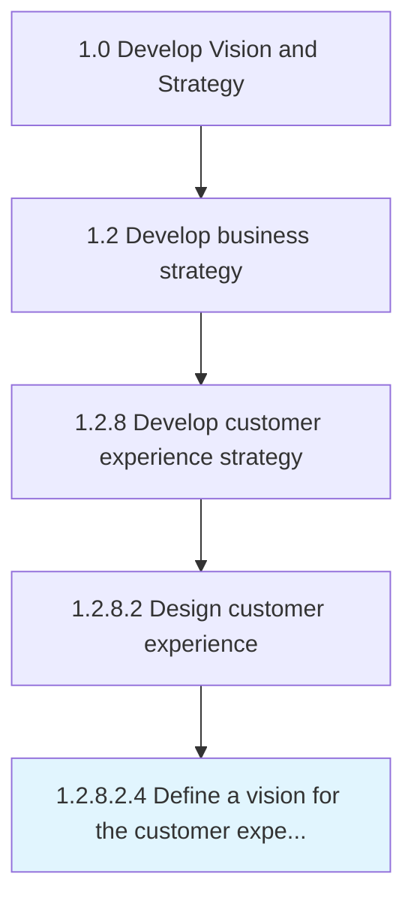

# Define a vision for the customer experience

> Establishing a direction and vision on how the organization behaves towards customers in a consistent, effective way.

## Overview

Sub-Activity 1.2.8.2.4 is an activity within the Develop Vision and Strategy framework. 

Establishing a direction and vision on how the organization behaves towards customers in a consistent, effective way. The key attributes for customer experience vision consists of emotional connection, commitments and expectations, compelling value proposition, and ease of understanding the organization's behavior.

## Process Hierarchy



## Key Statistics

| Metric | Value |
|--------|-------|
| APQC Code | 19967 |
| Hierarchy ID | 1.2.8.2.4 |
| Level | Sub-Activity |
| Parent | [1.2.8.2](../) |
| Sub-Processes | 0 |


## GraphDL Semantic Structure

```
define.AVision.for.TheCustomerExperience
```

| Component | Value | Description |
|-----------|-------|-------------|
| Verb | `define` | Primary action |
| Object | `a vision` | Direct object |
| Preposition | `for` | Relationship |
| PrepObject | `the customer experience` | Indirect object |


## Related Concepts

- Vision
- CustomerExperience


---

*Source: APQC PCF 19967 (1.2.8.2.4) - APQC*
