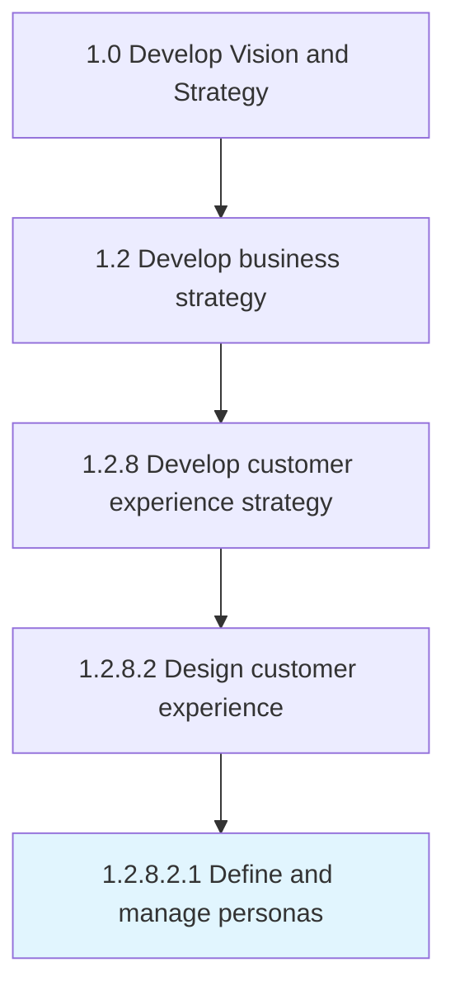

# Define and manage personas

> Identifying a set of characteristics that define the demographic and behavioral patterns of the customer.

## Overview

Sub-Activity 1.2.8.2.1 is an activity within the Develop Vision and Strategy framework. 

Identifying a set of characteristics that define the demographic and behavioral patterns of the customer. Further, use persona scoring to design your marketing strategies around personas, and measure and optimize your interactions with the contacts classified by a certain persona.

## Process Hierarchy



## Key Statistics

| Metric | Value |
|--------|-------|
| APQC Code | 16612 |
| Hierarchy ID | 1.2.8.2.1 |
| Level | Sub-Activity |
| Parent | [1.2.8.2](../) |
| Sub-Processes | 0 |


## GraphDL Semantic Structure

```
define.AndManagePersonas
```

| Component | Value | Description |
|-----------|-------|-------------|
| Verb | `define` | Primary action |
| Object | `and manage personas` | Direct object |


## Related Concepts

- [Personas](/concepts/Personas)
- [Personas](/concepts/Personas)


---

*Source: APQC PCF 16612 (1.2.8.2.1) - APQC*
