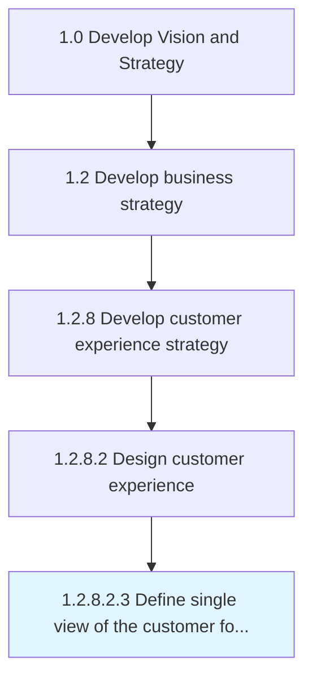

# Define single view of the customer for the organization

> Defining parameters to show aggregated, consistent, and holistic representation of known data about customers.

## Overview

Sub-Activity 1.2.8.2.3 is an activity within the Develop Vision and Strategy framework. 

Defining parameters to show aggregated, consistent, and holistic representation of known data about customers. Define key parameters which enable the tracking of customers and communications across every channel.

## Process Hierarchy



## Key Statistics

| Metric | Value |
|--------|-------|
| APQC Code | 19966 |
| Hierarchy ID | 1.2.8.2.3 |
| Level | Sub-Activity |
| Parent | [1.2.8.2](../) |
| Sub-Processes | 0 |


## GraphDL Semantic Structure

```
define.SingleView.of.TheCustomerForTheOrganization
```

| Component | Value | Description |
|-----------|-------|-------------|
| Verb | `define` | Primary action |
| Object | `single view` | Direct object |
| Preposition | `of` | Relationship |
| PrepObject | `the customer for the organization` | Indirect object |


## Related Concepts

- SingleView
- CustomerForOrganization


---

*Source: APQC PCF 19966 (1.2.8.2.3) - APQC*
