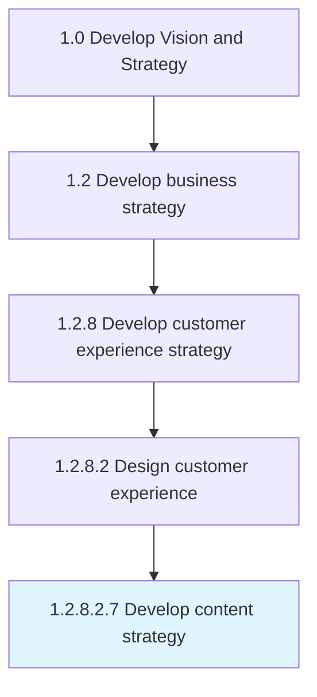

# Develop content strategy

> Planning, development, and management of content-written or in other media.

## Overview

Sub-Activity 1.2.8.2.7 is an activity within the Develop Vision and Strategy framework. 

Planning, development, and management of content-written or in other media. Getting the right content to the right user at the right time through strategic planning of content creation, delivery, and governance.

## Process Hierarchy



## Key Statistics

| Metric | Value |
|--------|-------|
| APQC Code | 19970 |
| Hierarchy ID | 1.2.8.2.7 |
| Level | Sub-Activity |
| Parent | [1.2.8.2](../) |
| Sub-Processes | 0 |


## GraphDL Semantic Structure

```
develop.ContentStrategy
```

| Component | Value | Description |
|-----------|-------|-------------|
| Verb | `develop` | Primary action |
| Object | `content strategy` | Direct object |


## Related Concepts

- [ContentStrategy](/concepts/ContentStrategy)


---

*Source: APQC PCF 19970 (1.2.8.2.7) - APQC*
