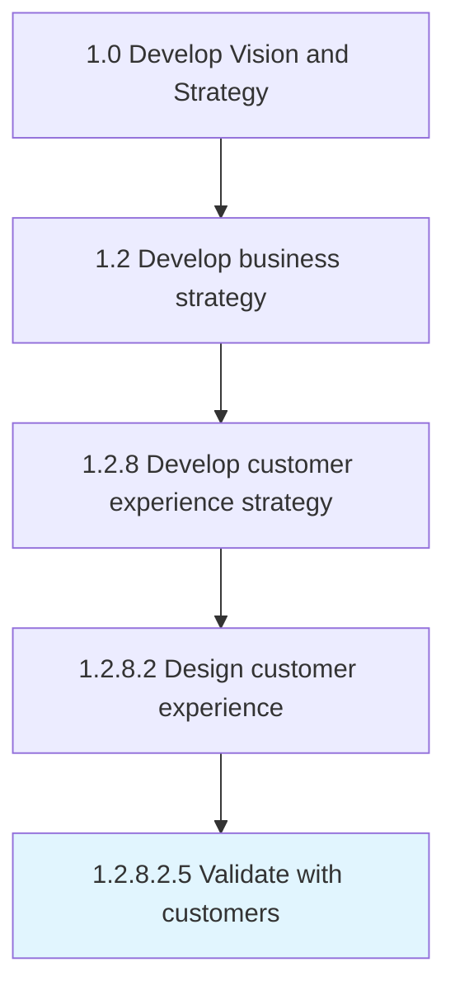

# Validate with customers

> Creating a process to validate the sales process and the assumptions that underpin the business model.

## Overview

Sub-Activity 1.2.8.2.5 is an activity within the Develop Vision and Strategy framework. 

Creating a process to validate the sales process and the assumptions that underpin the business model. Understand if the products/services have a repeatable, scalable business model around that product.

## Process Hierarchy



## Key Statistics

| Metric | Value |
|--------|-------|
| APQC Code | 19968 |
| Hierarchy ID | 1.2.8.2.5 |
| Level | Sub-Activity |
| Parent | [1.2.8.2](../) |
| Sub-Processes | 0 |


## GraphDL Semantic Structure

```
validate.WithCustomers
```

| Component | Value | Description |
|-----------|-------|-------------|
| Verb | `validate` | Primary action |
| Object | `with customers` | Direct object |


## Related Concepts

- [Customers](/concepts/Customers)


---

*Source: APQC PCF 19968 (1.2.8.2.5) - APQC*
