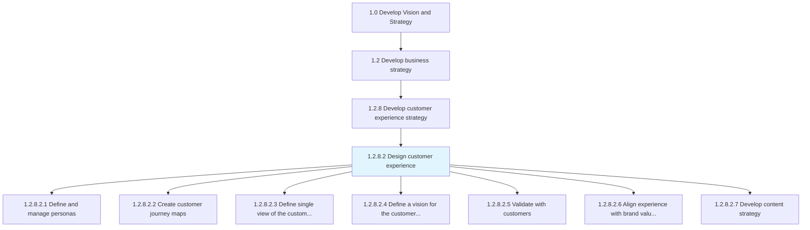
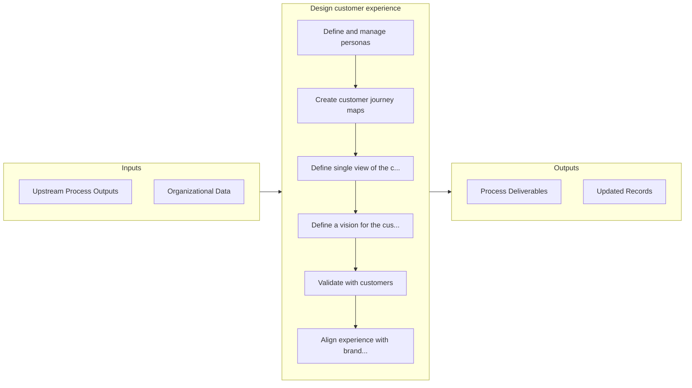

# Design customer experience

> Creating a design of how customers interact with the business by analyzing data captured through various customer interaction and customer involvement.

## Overview

Activity 1.2.8.2 is an activity within the Develop Vision and Strategy framework. 

Creating a design of how customers interact with the business by analyzing data captured through various customer interaction and customer involvement. These will be captured through various channels such as customer satisfaction surveys, feedback forms, product reviews, targeted studies, observational studies, or voice of customer research.

## Process Hierarchy



## Key Statistics

| Metric | Value |
|--------|-------|
| APQC Code | 19964 |
| Hierarchy ID | 1.2.8.2 |
| Level | Activity |
| Parent | [1.2.8](../) |
| Sub-Processes | 7 |


## GraphDL Semantic Structure

```
design.CustomerExperience
```

| Component | Value | Description |
|-----------|-------|-------------|
| Verb | `design` | Primary action |
| Object | `customer experience` | Direct object |


## Process Flow



## Sub-Processes

| Process | Hierarchy ID | Description |
|---------|-------------|-------------|
| [Define and manage personas](./DefineAndManagePersonas) | 1.2.8.2.1 | Identifying a set of characteristics that define the demographic and behavioral patterns of the cust |
| [Create customer journey maps](./CreateCustomerJourneyMaps) | 1.2.8.2.2 | Creating a story of the customer's experience: from initial contact, through the process of engageme |
| [Define single view of the customer for the organization](./DefineSingleViewOfTheCustomerForTheOrganization) | 1.2.8.2.3 | Defining parameters to show aggregated, consistent, and holistic representation of known data about  |
| [Define a vision for the customer experience](./DefineAVisionForTheCustomerExperience) | 1.2.8.2.4 | Establishing a direction and vision on how the organization behaves towards customers in a consisten |
| [Validate with customers](./ValidateWithCustomers) | 1.2.8.2.5 | Creating a process to validate the sales process and the assumptions that underpin the business mode |
| [Align experience with brand values and business strategies](./AlignExperienceWithBrandValuesAndBusinessStrategies) | 1.2.8.2.6 | Aligning and defining a relevant, differentiated, and credible value proposition for the brand |
| [Develop content strategy](./DevelopContentStrategy) | 1.2.8.2.7 | Planning, development, and management of content-written or in other media |


## Related Concepts

- [CustomerExperience](/concepts/CustomerExperience)


---

*Source: APQC PCF 19964 (1.2.8.2) - APQC*
