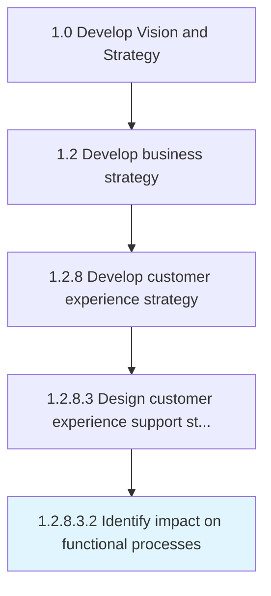

# Identify impact on functional processes

> Identifying the affect of customer experience through customer experience support structure on other functions of customer services related to customer.

## Overview

Sub-Activity 1.2.8.3.2 is an activity within the Develop Vision and Strategy framework. 

Identifying the affect of customer experience through customer experience support structure on other functions of customer services related to customer.

## Process Hierarchy



## Key Statistics

| Metric | Value |
|--------|-------|
| APQC Code | 19973 |
| Hierarchy ID | 1.2.8.3.2 |
| Level | Sub-Activity |
| Parent | [1.2.8.3](../) |
| Sub-Processes | 0 |


## GraphDL Semantic Structure

```
identify.Impact.on.FunctionalProcesses
```

| Component | Value | Description |
|-----------|-------|-------------|
| Verb | `identify` | Primary action |
| Object | `impact` | Direct object |
| Preposition | `on` | Relationship |
| PrepObject | `functional processes` | Indirect object |


## Related Concepts

- Impact
- FunctionalProcesses


---

*Source: APQC PCF 19973 (1.2.8.3.2) - APQC*
