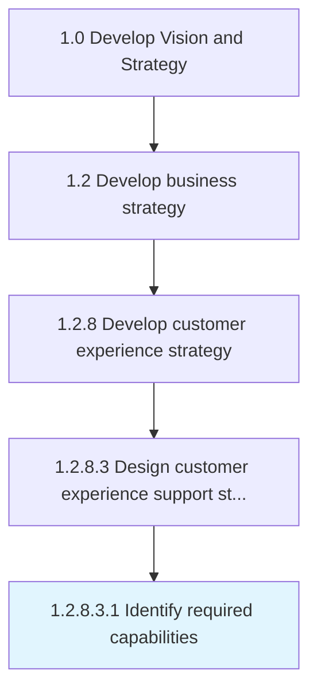

# Identify required capabilities

> Determining the necessary skills and competencies required to efficiently collect customer experiences through the support structure.

## Overview

Sub-Activity 1.2.8.3.1 is an activity within the Develop Vision and Strategy framework. 

Determining the necessary skills and competencies required to efficiently collect customer experiences through the support structure.

## Process Hierarchy



## Key Statistics

| Metric | Value |
|--------|-------|
| APQC Code | 19972 |
| Hierarchy ID | 1.2.8.3.1 |
| Level | Sub-Activity |
| Parent | [1.2.8.3](../) |
| Sub-Processes | 0 |


## GraphDL Semantic Structure

```
identify.RequiredCapabilities
```

| Component | Value | Description |
|-----------|-------|-------------|
| Verb | `identify` | Primary action |
| Object | `required capabilities` | Direct object |


## Related Concepts

- RequiredCapabilities


---

*Source: APQC PCF 19972 (1.2.8.3.1) - APQC*
