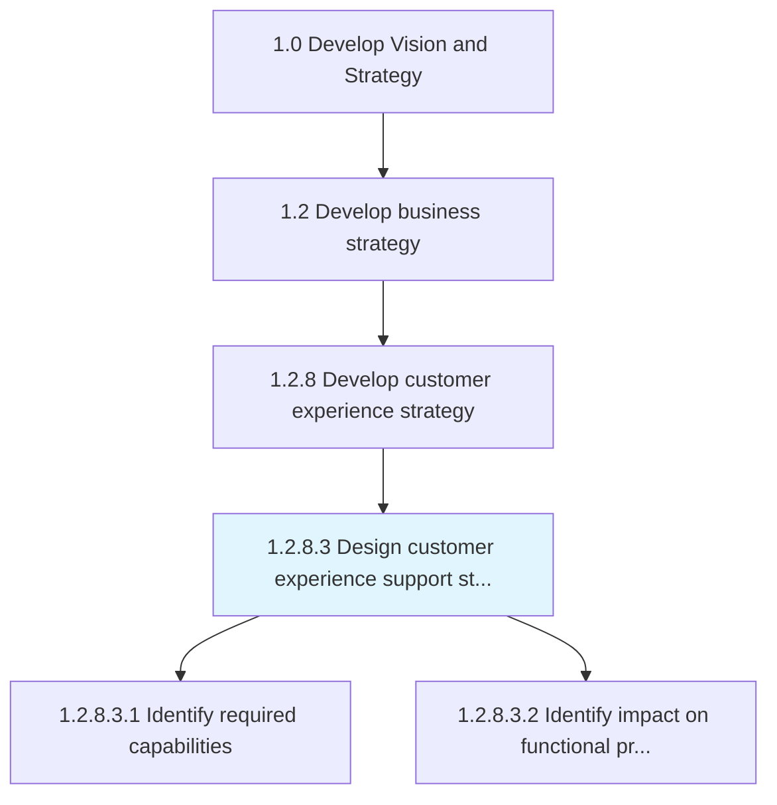
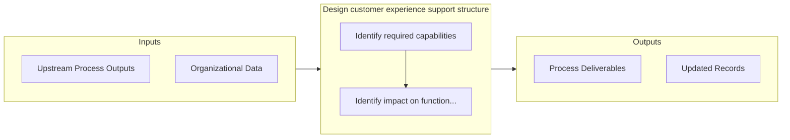
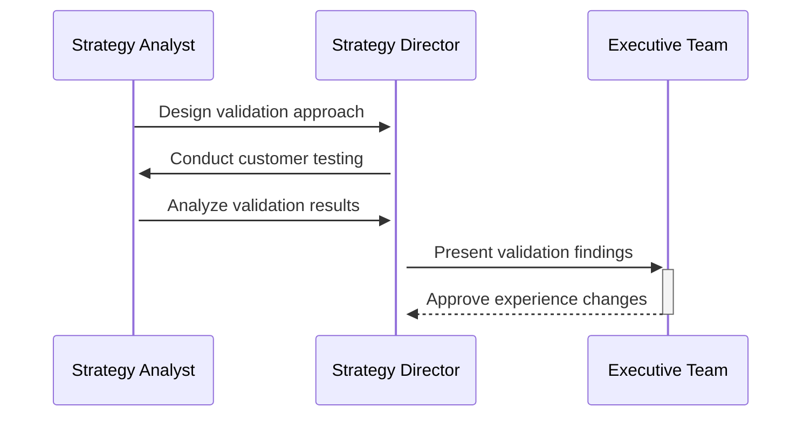

# Design customer experience support structure

> Creating a roadmap for customer experience support with an overall approach, process flow, and impact timeframe.

## Overview

Activity 1.2.8.3 is an activity within the Develop Vision and Strategy framework. 

Creating a roadmap for customer experience support with an overall approach, process flow, and impact timeframe.

## Process Hierarchy



## Key Statistics

| Metric | Value |
|--------|-------|
| APQC Code | 19971 |
| Hierarchy ID | 1.2.8.3 |
| Level | Activity |
| Parent | [1.2.8](../) |
| Sub-Processes | 2 |


## Process Overview

Strategy processes define the organization's vision, direction, and strategic initiatives to achieve business objectives. This process focuses on design customer experience support structure, which is essential for organizational effectiveness and achieving business objectives.

## Key Metrics

| Metric | Description | Target |
|--------|-------------|--------|
| Strategic initiative completion rate | Measure of strategic initiative completion rate | Target varies by organization |
| Revenue growth | Measure of revenue growth | Target varies by organization |
| Market share | Measure of market share | Target varies by organization |
| Customer satisfaction | Measure of customer satisfaction | Target varies by organization |

## Related Departments

- [Executive](/departments/Executive)
- [Strategy](/departments/Strategy)
- [Finance](/departments/Finance)

## Related Occupations

- [Chief Executives](/occupations/Management/ChiefExecutives)
- [Management Analysts](/occupations/Business/ManagementAnalysts)
- [General and Operations Managers](/occupations/Management/GeneralAndOperationsManagers)

## RACI Matrix

| Activity | Responsible | Accountable | Consulted | Informed |
|----------|-------------|-------------|-----------|----------|
| Plan | Process Owner | Manager | Stakeholders | Team |
| Execute | Team | Process Owner | Manager | Stakeholders |
| Monitor | Analyst | Manager | Process Owner | Leadership |
| Improve | Process Owner | Manager | Team | Stakeholders |

## GraphDL Semantic Structure

```graphdl
design.CustomerExperienceSupportStructure
```

| Component | Value | Description |
|-----------|-------|-------------|
| Verb | `design` | Primary action |
| Object | `customer experience support structure` | Direct object |


## Process Flow



## Process Sequence



## Sub-Processes

| Process | Hierarchy ID | Description |
|---------|-------------|-------------|
| [Identify required capabilities](./IdentifyRequiredCapabilities) | 1.2.8.3.1 | Determining the necessary skills and competencies required to efficiently collect customer experienc |
| [Identify impact on functional processes](./IdentifyImpactOnFunctionalProcesses) | 1.2.8.3.2 | Identifying the affect of customer experience through customer experience support structure on other |


## Related Concepts

- CustomerExperienceSupportStructure


---

*Source: APQC PCF 19971 (1.2.8.3) - APQC*
