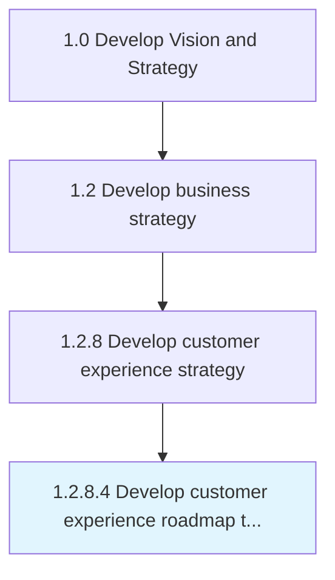

# Develop customer experience roadmap to develop and implement defined capabilities

> Defining a standard guideline to create and execute the capacities of registering customer experiences in a timely manner.

## Overview

Activity 1.2.8.4 is an activity within the Develop Vision and Strategy framework. 

Defining a standard guideline to create and execute the capacities of registering customer experiences in a timely manner. Create a common understanding of what behaviors are required to implement the strategy. Define what talent/skills your organization needs to reach customer experience goals.

## Process Hierarchy



## Key Statistics

| Metric | Value |
|--------|-------|
| APQC Code | 19974 |
| Hierarchy ID | 1.2.8.4 |
| Level | Activity |
| Parent | [1.2.8](../) |
| Sub-Processes | 0 |


## GraphDL Semantic Structure

```
develop.CustomerExperienceRoadmap.to.DevelopAndImplementDefinedCapabilities
```

| Component | Value | Description |
|-----------|-------|-------------|
| Verb | `develop` | Primary action |
| Object | `customer experience roadmap` | Direct object |
| Preposition | `to` | Relationship |
| PrepObject | `develop and implement defined capabilities` | Indirect object |


## Related Concepts

- CustomerExperienceRoadmap
- DevelopDefinedCapabilities
- CustomerExperienceRoadmap
- ImplementDefinedCapabilities


---

*Source: APQC PCF 19974 (1.2.8.4) - APQC*
