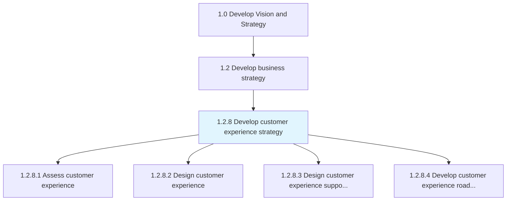
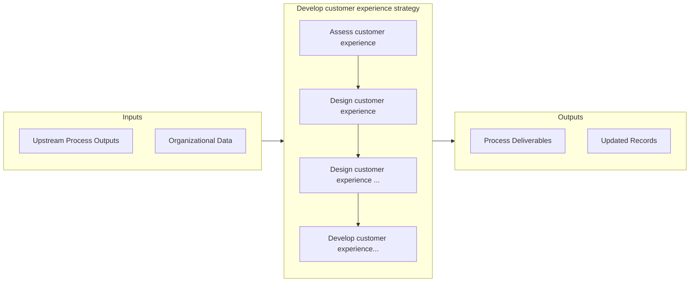

# Develop customer experience strategy

> Defining a roadmap to meet customer expectations while considering how it will affect the business.

## Overview

Process 1.2.8 is a core process that defines the specific procedures for develop customer experience strategy. 

Defining a roadmap to meet customer expectations while considering how it will affect the business.

## Process Hierarchy



## Key Statistics

| Metric | Value |
|--------|-------|
| APQC Code | 19959 |
| Hierarchy ID | 1.2.8 |
| Level | Process |
| Parent | [1.2](../) |
| Sub-Processes | 4 |


## GraphDL Semantic Structure

```
develop.CustomerExperienceStrategy
```

| Component | Value | Description |
|-----------|-------|-------------|
| Verb | `develop` | Primary action |
| Object | `customer experience strategy` | Direct object |


## Process Flow



## Sub-Processes

| Process | Hierarchy ID | Description |
|---------|-------------|-------------|
| [Assess customer experience](./1.2.8.1-AssessCustomerExperience/) | 1.2.8.1 | Measuring customer feedback in regard to product and services effectiveness based on overall satisfa |
| [Design customer experience](./1.2.8.2-DesignCustomerExperience/) | 1.2.8.2 | Creating a design of how customers interact with the business by analyzing data captured through var |
| [Design customer experience support structure](./1.2.8.3-DesignCustomerExperienceSupport/) | 1.2.8.3 | Creating a roadmap for customer experience support with an overall approach, process flow, and impac |
| [Develop customer experience roadmap to develop and implement defined capabilities](./DevelopCustomerExperienceRoadmapToDevelopAndImplementDefinedCapabilities) | 1.2.8.4 | Defining a standard guideline to create and execute the capacities of registering customer experienc |


## Related Concepts

- CustomerExperienceStrategy


---

*Source: APQC PCF 19959 (1.2.8) - APQC*
