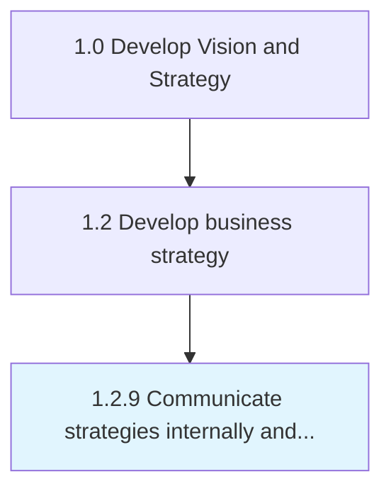

# Communicate strategies internally and externally

> Conveying planned procedures and methods to both internal departments and external stakeholders like customers, suppliers, etc.

## Overview

Process 1.2.9 is a core process that defines the specific procedures for communicate strategies internally and externally. 

Conveying planned procedures and methods to both internal departments and external stakeholders like customers, suppliers, etc., in an effective manner based on organizational objective.

## Process Hierarchy



## Key Statistics

| Metric | Value |
|--------|-------|
| APQC Code | 18916 |
| Hierarchy ID | 1.2.9 |
| Level | Process |
| Parent | [1.2](../) |
| Sub-Processes | 0 |


## GraphDL Semantic Structure

```
communicate.StrategiesInternallyAndExternally
```

| Component | Value | Description |
|-----------|-------|-------------|
| Verb | `communicate` | Primary action |
| Object | `strategies internally and externally` | Direct object |


## Related Concepts

- StrategiesInternally
- Externally


---

*Source: APQC PCF 18916 (1.2.9) - APQC*
