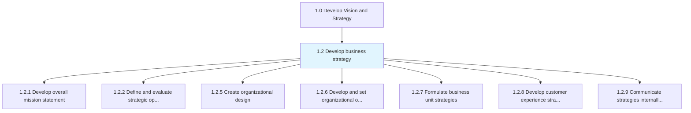
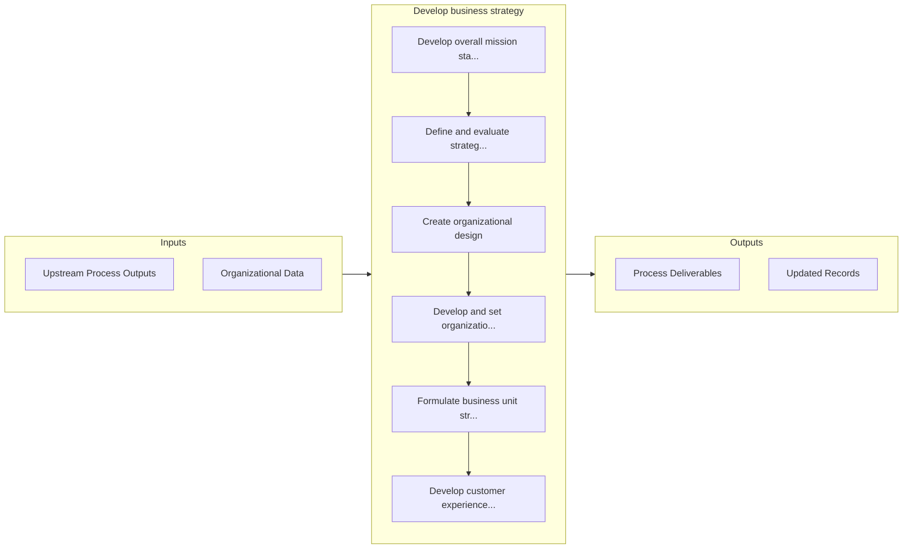

# Develop business strategy

> Developing an organization's mission statement, strategy, and business design.

## Overview

Group 1.2 is a process group within APQC Category 1.0 (Develop Vision and Strategy). 

Developing an organization's mission statement, strategy, and business design. Create a concise statement that clearly articulates the mission of the organization, outlining practicable targets to Establish a strategic vision [10020]. Delineate strategic options by matching these alternatives with the organization's internal capabilities. Create an organizational design, and identify goals by developing strategies at the functional and process levels.

## Process Hierarchy



## Key Statistics

| Metric | Value |
|--------|-------|
| APQC Code | 10015 |
| Hierarchy ID | 1.2 |
| Level | Group |
| Parent | [1](../) |
| Sub-Processes | 7 |


## GraphDL Semantic Structure

```
develop.BusinessStrategy
```

| Component | Value | Description |
|-----------|-------|-------------|
| Verb | `develop` | Primary action |
| Object | `business strategy` | Direct object |


## Process Flow



## Sub-Processes

| Process | Hierarchy ID | Description |
|---------|-------------|-------------|
| [Develop overall mission statement](./1.2.1-DevelopOverallMissionStatement/) | 1.2.1 | Establishing an overarching, compact statement that concisely underscores the mission of the organiz |
| [Define and evaluate strategic options to achieve the mission](./1.2.2-DefineEvaluateStrategicOptions/) | 1.2.2 | Assessing sets of strategic decisions designed to drive the organization's long-term objectives |
| [Create organizational design](./1.2.5-CreateOrganizationalDesign/) | 1.2.5 | Formulating a design for the organization's resources that allow it to meet its objectives |
| [Develop and set organizational objectives](./1.2.6-DevelopSetOrganizationalObjectives/) | 1.2.6 | Developing overall goals for the organization that help in accomplishing its mission |
| [Formulate business unit strategies](./1.2.7-FormulateBusinessUnitStrategies/) | 1.2.7 | Charting a strategic course for business units in order to leverage opportunities, sidestep hurdles, |
| [Develop customer experience strategy](./1.2.8-DevelopCustomerExperienceStrategy/) | 1.2.8 | Defining a roadmap to meet customer expectations while considering how it will affect the business |
| [Communicate strategies internally and externally](./CommunicateStrategiesInternallyAndExternally) | 1.2.9 | Conveying planned procedures and methods to both internal departments and external stakeholders like |


## Related Concepts

- [BusinessStrategy](/concepts/BusinessStrategy)


---

*Source: APQC PCF 10015 (1.2) - APQC*
