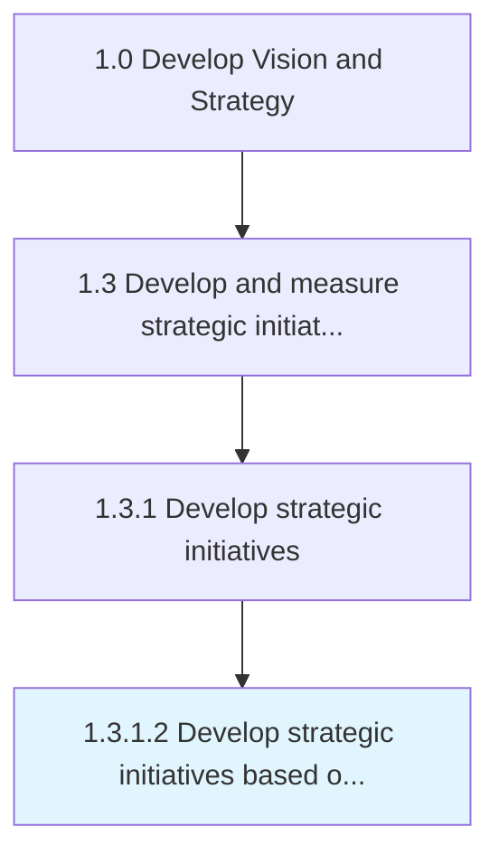

# Develop strategic initiatives based on business/customer value

> Creating a statement of the organization's direction based on what is considered "value" to the customer or business.

## Overview

Activity 1.3.1.2 is an activity within the Develop Vision and Strategy framework. 

Creating a statement of the organization's direction based on what is considered "value" to the customer or business.

## Process Hierarchy



## Key Statistics

| Metric | Value |
|--------|-------|
| APQC Code | 19976 |
| Hierarchy ID | 1.3.1.2 |
| Level | Activity |
| Parent | [1.3.1](../) |
| Sub-Processes | 0 |


## GraphDL Semantic Structure

```
develop.StrategicInitiativesBased.on.BusinesscustomerValue
```

| Component | Value | Description |
|-----------|-------|-------------|
| Verb | `develop` | Primary action |
| Object | `strategic initiatives based` | Direct object |
| Preposition | `on` | Relationship |
| PrepObject | `business/customer value` | Indirect object |


## Related Concepts

- StrategicInitiativesBased
- BusinessValue
- StrategicInitiativesBased
- CustomerValue


---

*Source: APQC PCF 19976 (1.3.1.2) - APQC*
