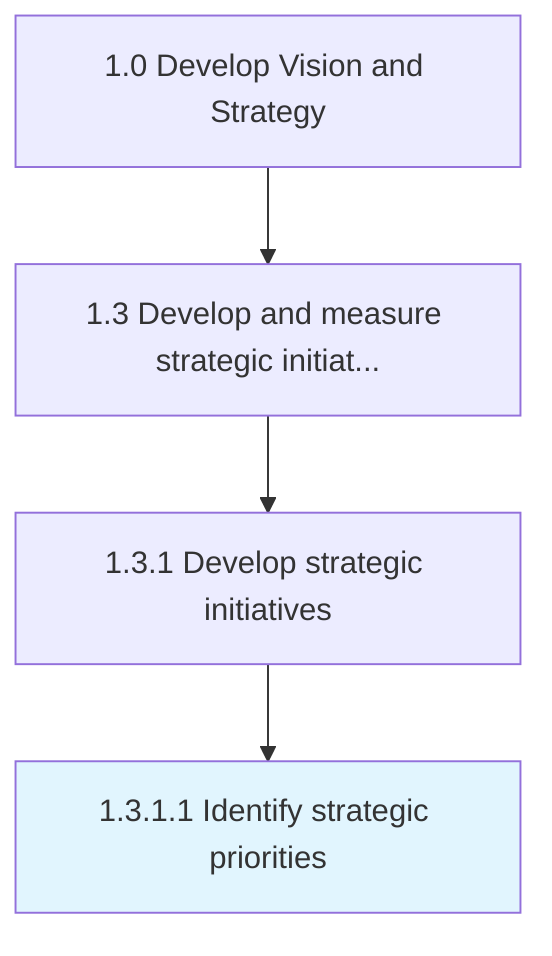

# Identify strategic priorities

> Creating a statement of the organization's direction to guide decision making around the allocation of resources.

## Overview

Activity 1.3.1.1 is an activity within the Develop Vision and Strategy framework. 

Creating a statement of the organization's direction to guide decision making around the allocation of resources. Provide a focus on the organization's overarching goals to ensure coherent and considered action. Strategic objectives are ranked by their importance in achieving the strategic goals. All subsequent operational or tactical planning and resource allocation is based on strategic priorities

## Process Hierarchy



## Key Statistics

| Metric | Value |
|--------|-------|
| APQC Code | 19975 |
| Hierarchy ID | 1.3.1.1 |
| Level | Activity |
| Parent | [1.3.1](../) |
| Sub-Processes | 0 |


## GraphDL Semantic Structure

```
identify.StrategicPriorities
```

| Component | Value | Description |
|-----------|-------|-------------|
| Verb | `identify` | Primary action |
| Object | `strategic priorities` | Direct object |


## Related Concepts

- StrategicPriorities


---

*Source: APQC PCF 19975 (1.3.1.1) - APQC*
