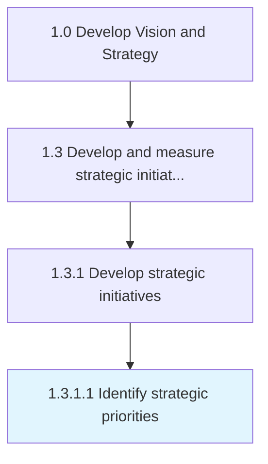
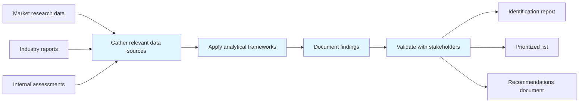

# Identify strategic priorities

> Creating a statement of the organization's direction to guide decision making around the allocation of resources.

## Overview

Activity 1.3.1.1 is an activity within the Develop Vision and Strategy framework. 

Creating a statement of the organization's direction to guide decision making around the allocation of resources. Provide a focus on the organization's overarching goals to ensure coherent and considered action. Strategic objectives are ranked by their importance in achieving the strategic goals. All subsequent operational or tactical planning and resource allocation is based on strategic priorities

This process plays a critical role within the broader "Develop Vision and Strategy" capability area (APQC Category 1.0). By systematically executing this activity, organizations ensure that strategic decisions are grounded in thorough analysis and aligned with overall business objectives. The outputs of this process feed into downstream strategy development and execution activities, creating a foundation for informed decision-making across the enterprise.

## Process Hierarchy



## Key Statistics

| Metric | Value |
|--------|-------|
| APQC Code | 19975 |
| Hierarchy ID | 1.3.1.1 |
| Level | Activity |
| Parent | [1.3.1](../) |
| Sub-Processes | 0 |
| Estimated Duration | 1-4 weeks |
| Complexity | Medium |

## GraphDL Semantic Structure

```graphdl
identify.StrategicPriorities
```

| Component | Value | Description |
|-----------|-------|-------------|
| Verb | `identify` | Primary action |
| Object | `strategic priorities` | Direct object |

## Process Flow



## RACI Matrix

| Activity | Responsible | Accountable | Consulted | Informed |
|----------|-------------|-------------|-----------|----------|
| Define initiative scope | Project Manager | Strategy Director | Business Unit Leaders | Stakeholders |
| Plan and resource | Project Manager | Chief Operating Officer | Finance Team | Department Heads |
| Execute activities | Initiative Lead | Project Manager | Cross-functional Teams | Executive Sponsors |
| Monitor and report | Project Analyst | Project Manager | Strategy Team | Executive Team |

## Related Occupations

| Occupation | Role in Process |
|------------|----------------|
| [Chief Executives](/occupations/Management/ChiefExecutives) | Primary strategic oversight and decision authority |
| [Project Management Specialists](/occupations/Business/Operations/ProjectManagementSpecialists) | Executes analysis and produces deliverables |
| [Management Analysts](/occupations/Business/Operations/ManagementAnalysts) | Provides analytical frameworks and recommendations |
| [Business Intelligence Analysts](/occupations/Technology/BusinessIntelligenceAnalysts) | Supports data gathering and insight generation |
| [Strategic Planners](/occupations/StrategicPlanners) | Coordinates strategic alignment and planning |

## Related Departments

| Department | Involvement |
|------------|-------------|
| Strategy & Planning | Primary owner and executor of this process |
| Project Management Office (PMO) | Provides supporting data, resources, and coordination |
| Executive Leadership | Provides governance, approval, and strategic direction |

## Industry Variations

| Industry | Variation | Reference |
|----------|-----------|-----------|
| Manufacturing | Emphasizes supply chain and operational efficiency metrics in strategic planning | [manufacturing](/industries/manufacturing) |
| Financial Services | Focuses on regulatory compliance and risk management within strategy processes | [banking](/industries/banking) |
| Technology | Prioritizes innovation velocity and digital transformation in strategic initiatives | [consumer-electronics](/industries/consumer-electronics) |

## KPIs & Metrics

| KPI | Description | Target |
|-----|-------------|--------|
| Completeness Rate | Percentage of relevant items identified vs. total known | > 85% |
| Time to Identification | Average time from initiation to completion | < 2 weeks |
| Stakeholder Satisfaction | Satisfaction score from key stakeholders | > 4.0/5.0 |

## Related Concepts

- StrategicPriorities

---

*Source: APQC PCF 19975 (1.3.1.1) - APQC*
