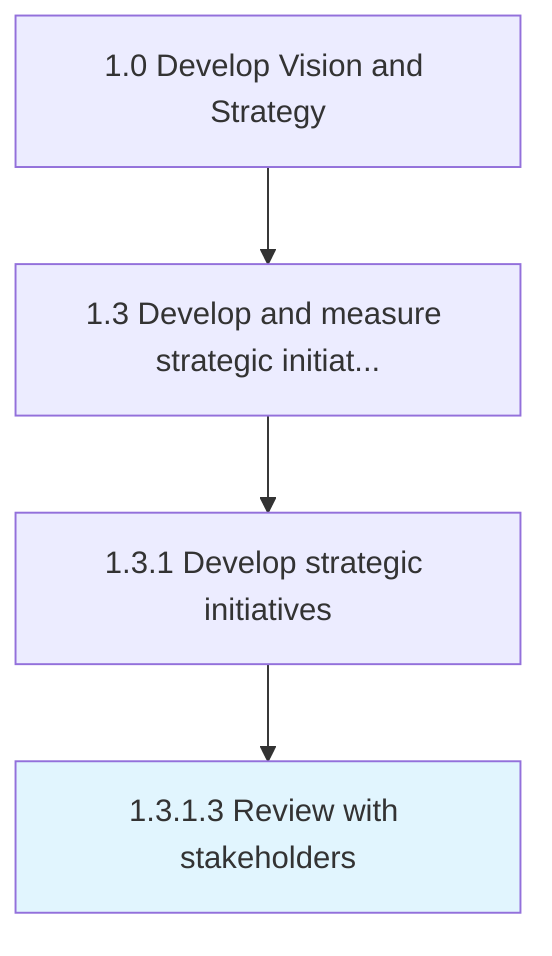
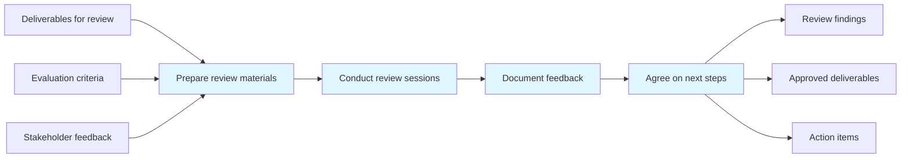

# Review with stakeholders

> Developing a process for stakeholder dialog that is integrated into the assessment of business strategies.

## Overview

Activity 1.3.1.3 is an activity within the Develop Vision and Strategy framework. 

Developing a process for stakeholder dialog that is integrated into the assessment of business strategies. Report on the evaluation of the business objectives, strategies, subject, or past events.

This process plays a critical role within the broader "Develop Vision and Strategy" capability area (APQC Category 1.0). By systematically executing this activity, organizations ensure that strategic decisions are grounded in thorough analysis and aligned with overall business objectives. The outputs of this process feed into downstream strategy development and execution activities, creating a foundation for informed decision-making across the enterprise.

## Process Hierarchy



## Key Statistics

| Metric | Value |
|--------|-------|
| APQC Code | 19977 |
| Hierarchy ID | 1.3.1.3 |
| Level | Activity |
| Parent | [1.3.1](../) |
| Sub-Processes | 0 |
| Estimated Duration | 1-4 weeks |
| Complexity | Medium |

## GraphDL Semantic Structure

```
review.WithStakeholders
```

| Component | Value | Description |
|-----------|-------|-------------|
| Verb | `review` | Primary action |
| Object | `with stakeholders` | Direct object |

## Process Flow



## RACI Matrix

| Activity | Responsible | Accountable | Consulted | Informed |
|----------|-------------|-------------|-----------|----------|
| Define initiative scope | Project Manager | Strategy Director | Business Unit Leaders | Stakeholders |
| Plan and resource | Project Manager | Chief Operating Officer | Finance Team | Department Heads |
| Execute activities | Initiative Lead | Project Manager | Cross-functional Teams | Executive Sponsors |
| Monitor and report | Project Analyst | Project Manager | Strategy Team | Executive Team |

## Related Occupations

| Occupation | Role in Process |
|------------|----------------|
| [Chief Executives](/occupations/ChiefExecutives) | Primary strategic oversight and decision authority |
| [Project Management Specialists](/occupations/ProjectManagementSpecialists) | Executes analysis and produces deliverables |
| [Management Analysts](/occupations/ManagementAnalysts) | Provides analytical frameworks and recommendations |
| [Business Intelligence Analysts](/occupations/BusinessIntelligenceAnalysts) | Supports data gathering and insight generation |
| [Strategic Planners](/occupations/StrategicPlanners) | Coordinates strategic alignment and planning |

## Related Departments

| Department | Involvement |
|------------|-------------|
| [Strategy & Planning](/departments/StrategyAndPlanning) | Primary owner and executor of this process |
| [Project Management Office (PMO)](/departments/ProjectManagementOffice) | Provides supporting data, resources, and coordination |
| [Executive Leadership](/departments/ExecutiveLeadership) | Provides governance, approval, and strategic direction |

## Industry Variations

| Industry | Variation | Reference |
|----------|-----------|-----------|
| Manufacturing | Emphasizes supply chain and operational efficiency metrics in strategic planning | [manufacturing](/industries/manufacturing) |
| Financial Services | Focuses on regulatory compliance and risk management within strategy processes | [banking](/industries/banking) |
| Technology | Prioritizes innovation velocity and digital transformation in strategic initiatives | [consumer-electronics](/industries/consumer-electronics) |

## KPIs & Metrics

| KPI | Description | Target |
|-----|-------------|--------|
| Process Completion Rate | Percentage of process completed on schedule | > 95% |
| Stakeholder Satisfaction | Average satisfaction rating from involved parties | > 4.0/5.0 |
| Output Quality Score | Quality assessment of process deliverables | > 80% |

## Related Concepts

- Stakeholders

---

*Source: APQC PCF 19977 (1.3.1.3) - APQC*
