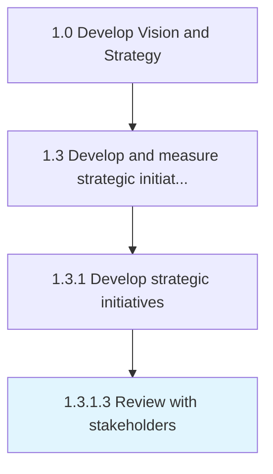

# Review with stakeholders

> Developing a process for stakeholder dialog that is integrated into the assessment of business strategies.

## Overview

Activity 1.3.1.3 is an activity within the Develop Vision and Strategy framework. 

Developing a process for stakeholder dialog that is integrated into the assessment of business strategies. Report on the evaluation of the business objectives, strategies, subject, or past events.

## Process Hierarchy



## Key Statistics

| Metric | Value |
|--------|-------|
| APQC Code | 19977 |
| Hierarchy ID | 1.3.1.3 |
| Level | Activity |
| Parent | [1.3.1](../) |
| Sub-Processes | 0 |


## GraphDL Semantic Structure

```
review.WithStakeholders
```

| Component | Value | Description |
|-----------|-------|-------------|
| Verb | `review` | Primary action |
| Object | `with stakeholders` | Direct object |


## Related Concepts

- Stakeholders


---

*Source: APQC PCF 19977 (1.3.1.3) - APQC*
