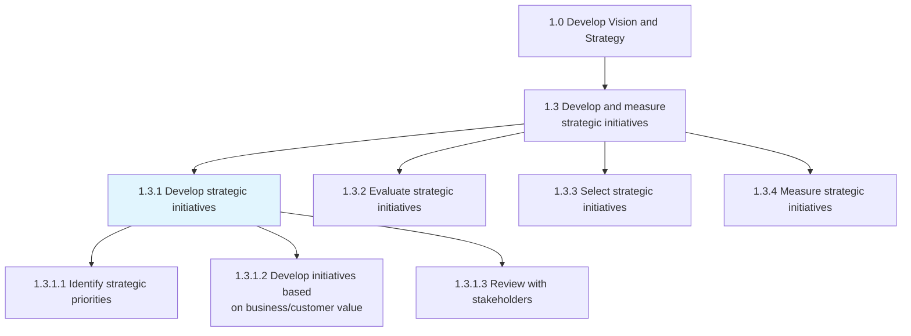
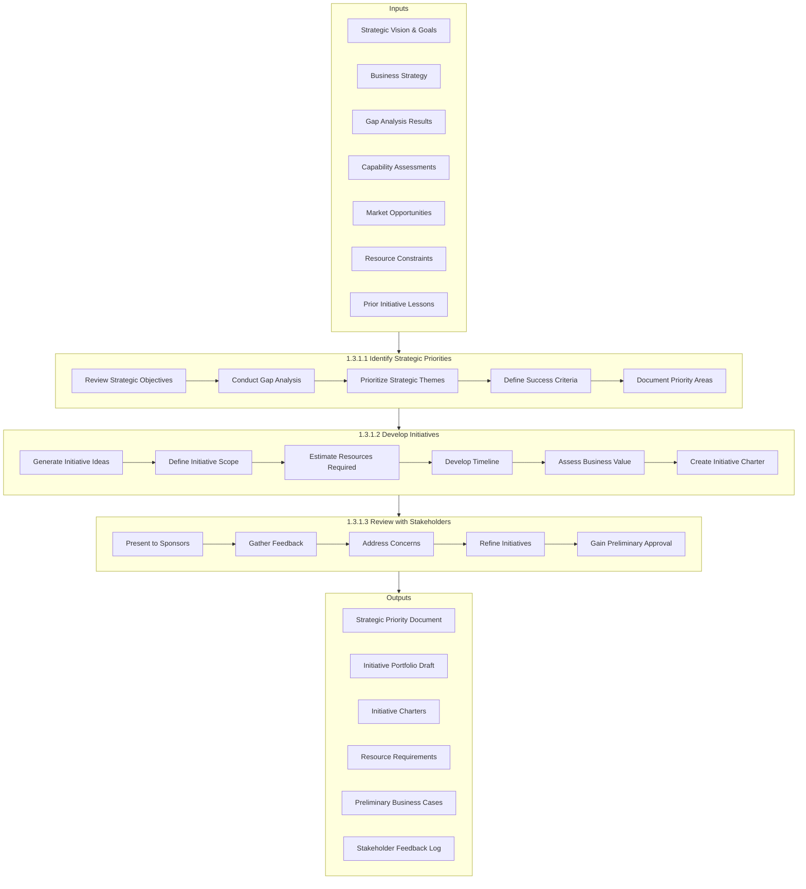
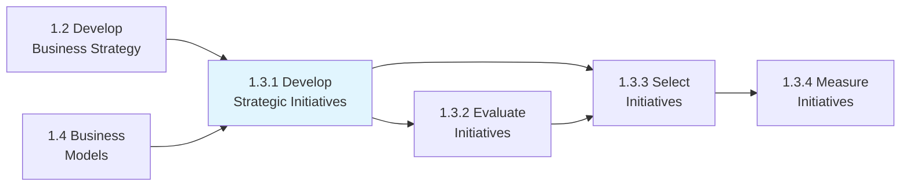

# Develop strategic initiatives

> Developing strategic projects that help fulfill long-term goals.

## Overview

Process 1.3.1 - Develop Strategic Initiatives is a core process that transforms organizational strategy into actionable, time-bound projects. Strategic initiatives are discretionary investments that lie beyond the scope of routine operations and are designed to create step-change improvements in organizational capabilities, market position, or operational performance.

Unlike operational projects that maintain the status quo, strategic initiatives are transformational in nature. They bridge the gap between where the organization is today and where the strategic vision says it should be in the future. Effective initiative development requires a deep understanding of strategic priorities, resource constraints, organizational capabilities, and the interdependencies between different strategic objectives.

This process produces a portfolio of well-defined initiatives with clear scope, objectives, resource requirements, timelines, and success metrics. These initiatives feed into the evaluation and selection processes (1.3.2 and 1.3.3) where they are prioritized and resourced.

## Process Hierarchy



## Key Statistics

| Metric | Value |
|--------|-------|
| APQC Code | 10057 |
| Hierarchy ID | 1.3.1 |
| Level | Process |
| Parent | [1.3 Develop and Measure Strategic Initiatives](../) |
| Child Activities | 3 |
| Typical Duration | 4-8 weeks |
| Annual Cycle | Q3-Q4 for next year planning |

## GraphDL Semantic Structure

```graphdl
develop.StrategicInitiatives
```

| Component | Value | Description |
|-----------|-------|-------------|
| Verb | `develop` | Creating and defining |
| Object | `StrategicInitiatives` | Transformational projects |
| Preposition | - | Not applicable |
| PrepObject | - | Not applicable |

## Process Flow



## Sub-Processes

### [1.3.1.1 Identify strategic priorities](./IdentifyStrategicPriorities/)

Creating a statement of the organization's direction to guide decision making around the allocation of resources, including capital and people.

**Key Activities:**
- Review and interpret strategic vision and goals
- Analyze current state vs. desired future state
- Identify capability and performance gaps
- Prioritize strategic themes based on impact
- Define success criteria for each priority area
- Document strategic priority framework

**APQC Code:** 10060 | **Typical Duration:** 1-2 weeks

### [1.3.1.2 Develop strategic initiatives based on business/customer value](./DevelopStrategicInitiativesBasedOnBusinesscustomerValue/)

Creating a statement of the organization's direction based on what is considered "value" to the customer, ensuring initiatives drive meaningful business and customer outcomes.

**Key Activities:**
- Generate initiative concepts aligned with priorities
- Define initiative scope, objectives, and deliverables
- Estimate resource requirements (budget, people, time)
- Develop preliminary project timeline
- Assess expected business and customer value
- Create initiative charter documentation

**APQC Code:** 10061 | **Typical Duration:** 2-4 weeks

### [1.3.1.3 Review with stakeholders](./ReviewWithStakeholders/)

Developing a process for stakeholder dialog that is integrated into the assessment of business strategy, ensuring alignment and buy-in across the organization.

**Key Activities:**
- Present initiative proposals to sponsors
- Facilitate stakeholder feedback sessions
- Address concerns and objections
- Incorporate feedback into initiative design
- Gain preliminary approval to proceed
- Document stakeholder commitments

**APQC Code:** 10062 | **Typical Duration:** 1-2 weeks

## Initiative Development Framework

| Element | Description | Key Questions |
|---------|-------------|---------------|
| Strategic Alignment | Connection to strategic goals | Which strategic priorities does this support? |
| Problem Statement | Issue or opportunity addressed | What problem are we solving? |
| Scope | Boundaries and deliverables | What is included/excluded? |
| Objectives | Measurable outcomes | What will success look like? |
| Value Proposition | Benefits to business/customers | Why should we invest in this? |
| Resource Requirements | People, budget, technology | What resources are needed? |
| Timeline | Key milestones and completion | When will we achieve outcomes? |
| Dependencies | Related initiatives and constraints | What must happen first or in parallel? |
| Risks | Potential obstacles | What could prevent success? |
| Success Metrics | KPIs and measurement | How will we know we succeeded? |

## RACI Matrix

| Activity | Responsible | Accountable | Consulted | Informed |
|----------|-------------|-------------|-----------|----------|
| Identify strategic priorities | Strategy Team | CSO/CEO | Executive Team | Board |
| Conduct gap analysis | Strategy/Operations | COO | All Functions | Leadership |
| Generate initiative ideas | Cross-functional Teams | CSO | All Stakeholders | PMO |
| Define initiative scope | Initiative Sponsors | CSO | Finance, Operations | PMO |
| Estimate resources | Finance/PMO | CFO | HR, IT, Operations | Strategy |
| Create initiative charters | PMO | Initiative Sponsors | Strategy | Executives |
| Review with stakeholders | Initiative Sponsors | CEO | All Stakeholders | Board |
| Gain preliminary approval | Executive Team | CEO | Board | All |

## Metrics & KPIs

| Metric | Description | Target | Frequency |
|--------|-------------|--------|-----------|
| Initiative Pipeline Quality | Percentage of initiatives meeting charter standards | >90% | Per cycle |
| Strategic Alignment Score | Initiatives mapped to strategic priorities | 100% | Per initiative |
| Stakeholder Approval Rate | Initiatives receiving preliminary approval | >70% | Per cycle |
| Time to Charter | Days from ideation to approved charter | <30 days | Per initiative |
| Resource Accuracy | Actual vs. estimated resource requirements | Within 20% | Post-implementation |
| Value Realization | Initiatives delivering projected value | >75% | Annually |
| Initiative Diversity | Balance across strategic themes | Balanced | Annually |

## Related Departments

| Department | Role in Initiative Development |
|------------|-------------------------------|
| Strategy | Process ownership and priority setting |
| PMO | Initiative charter development and standards |
| Finance | Resource estimation and business case support |
| HR | People resource planning and capability assessment |
| IT | Technology requirements and feasibility |
| Operations | Operational feasibility and impact assessment |
| Business Units | Initiative ideation and sponsorship |

## Related Occupations

- [Chief Strategy Officers](/occupations/Management/StrategyOfficers) - Process accountability
- [Strategic Planners](/occupations/Business/StrategicPlanners) - Priority identification
- [Project/Program Managers](/occupations/Business/ProjectManagers) - Charter development
- [Business Analysts](/occupations/Business/ManagementAnalysts) - Gap analysis and requirements
- [Financial Analysts](/occupations/Business/FinancialAnalysts) - Business case development
- [Change Managers](/occupations/Business/ManagementAnalysts) - Stakeholder engagement

## Industry Variations

### Technology
Emphasis on innovation initiatives, platform development, and technical debt reduction. Agile initiative structures with shorter planning horizons. Strong focus on talent and capability initiatives.

### Healthcare
Initiatives often driven by regulatory requirements, quality improvement, and patient experience. Longer approval cycles due to clinical governance. Integration initiatives common in M&A-heavy environment.

### Financial Services
Risk and compliance initiatives often mandatory. Digital transformation initiatives prominent. Strong emphasis on customer experience and operational efficiency.

### Manufacturing
Capital-intensive initiatives with longer payback periods. Focus on operational excellence, automation, and supply chain optimization. Safety and sustainability initiatives increasingly important.

### Retail
Customer experience and omnichannel initiatives prioritized. Speed to market critical. Store footprint and real estate initiatives require long lead times.

## Best Practices

### Initiative Ideation
- Cast wide net for ideas across organization
- Use strategic priorities as filtering criteria
- Consider both defensive and offensive initiatives
- Balance quick wins with transformational investments
- Look externally for innovation inspiration

### Charter Development
- Use standardized charter template
- Ensure clear problem/opportunity statement
- Define SMART objectives and success metrics
- Be realistic about resource requirements
- Identify key dependencies and risks early

### Stakeholder Review
- Engage stakeholders early and often
- Use structured feedback mechanisms
- Address concerns transparently
- Build coalition of support
- Document commitments and decisions

## Related Processes



## Related Concepts

- Strategic Initiatives
- Strategic Priorities
- Initiative Portfolio
- Business Value
- Customer Value
- Resource Allocation
- Stakeholder Alignment

---

*Source: APQC PCF 10057 (1.3.1) - Cross-Industry*
