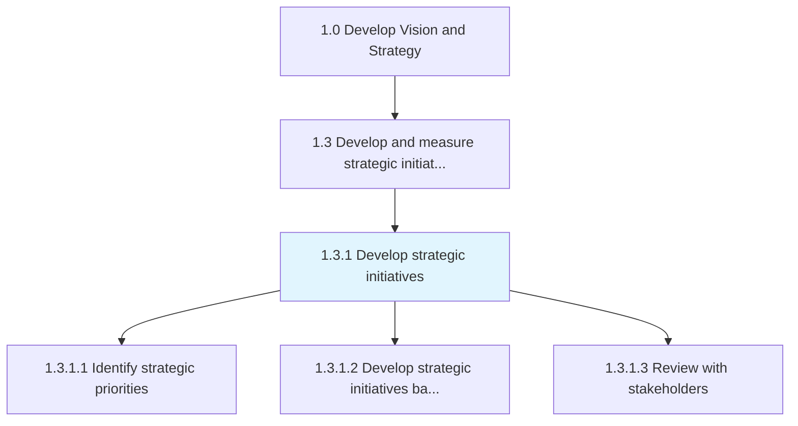
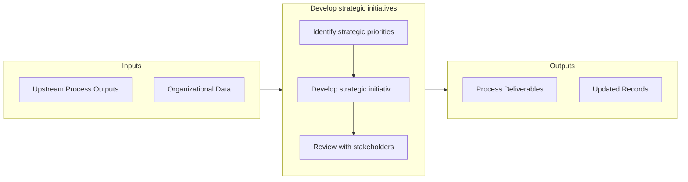

# Develop strategic initiatives

> Developing strategic projects that help fulfill long-term goals.

## Overview

Process 1.3.1 is a core process that defines the specific procedures for develop strategic initiatives. 

Developing strategic projects that help fulfill long-term goals. Develop time-bound projects that are discretionary in nature and lie beyond the scope of the organization's routine operations.

## Process Hierarchy



## Key Statistics

| Metric | Value |
|--------|-------|
| APQC Code | 10057 |
| Hierarchy ID | 1.3.1 |
| Level | Process |
| Parent | [1.3](../) |
| Sub-Processes | 3 |


## GraphDL Semantic Structure

```graphdl
develop.StrategicInitiatives
```

| Component | Value | Description |
|-----------|-------|-------------|
| Verb | `develop` | Primary action |
| Object | `strategic initiatives` | Direct object |


## Process Flow



## Sub-Processes

| Process | Hierarchy ID | Description |
|---------|-------------|-------------|
| [Identify strategic priorities](./IdentifyStrategicPriorities) | 1.3.1.1 | Creating a statement of the organization's direction to guide decision making around the allocation  |
| [Develop strategic initiatives based on business/customer value](./DevelopStrategicInitiativesBasedOnBusinesscustomerValue) | 1.3.1.2 | Creating a statement of the organization's direction based on what is considered "value" to the cust |
| [Review with stakeholders](./ReviewWithStakeholders) | 1.3.1.3 | Developing a process for stakeholder dialog that is integrated into the assessment of business strat |


## Related Concepts

- StrategicInitiatives


---

*Source: APQC PCF 10057 (1.3.1) - APQC*
