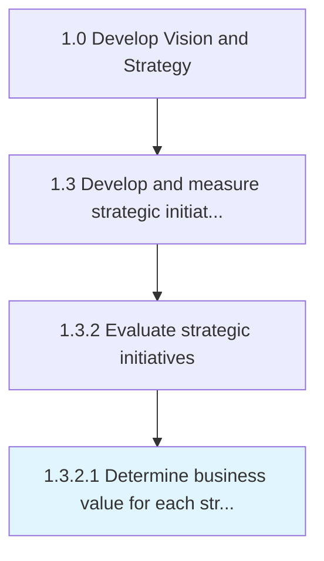

# Determine business value for each strategic priority

> Establishing a standard measure of value to determine the business worth for each of the Identify strategic priorities [19975].

## Overview

Activity 1.3.2.1 is an activity within the Develop Vision and Strategy framework. 

Establishing a standard measure of value to determine the business worth for each of the Identify strategic priorities [19975]. List the effectiveness and utility for every important strategic element based on the benefit it adds to the business.

## Process Hierarchy



## Key Statistics

| Metric | Value |
|--------|-------|
| APQC Code | 19978 |
| Hierarchy ID | 1.3.2.1 |
| Level | Activity |
| Parent | [1.3.2](../) |
| Sub-Processes | 0 |


## GraphDL Semantic Structure

```
determine.BusinessValue.for.EachStrategicPriority
```

| Component | Value | Description |
|-----------|-------|-------------|
| Verb | `determine` | Primary action |
| Object | `business value` | Direct object |
| Preposition | `for` | Relationship |
| PrepObject | `each strategic priority` | Indirect object |


## Related Concepts

- BusinessValue
- StrategicPriority


---

*Source: APQC PCF 19978 (1.3.2.1) - APQC*
