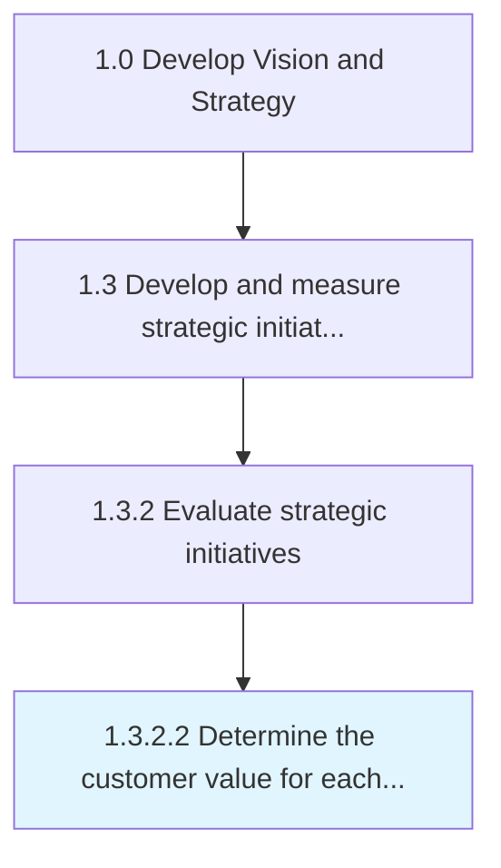

# Determine the customer value for each strategic priority

> Analyzing the value preposition; the value the customer gets from a product/services for each of your Identify strategic priorities [19975].

## Overview

Activity 1.3.2.2 is an activity within the Develop Vision and Strategy framework. 

Analyzing the value preposition; the value the customer gets from a product/services for each of your Identify strategic priorities [19975]. Customer value is the satisfaction a consumer feels after making a purchase for goods or services relative to what he/she must give up to receive them.

## Process Hierarchy



## Key Statistics

| Metric | Value |
|--------|-------|
| APQC Code | 19979 |
| Hierarchy ID | 1.3.2.2 |
| Level | Activity |
| Parent | [1.3.2](../) |
| Sub-Processes | 0 |


## GraphDL Semantic Structure

```
determine.TheCustomerValue.for.EachStrategicPriority
```

| Component | Value | Description |
|-----------|-------|-------------|
| Verb | `determine` | Primary action |
| Object | `the customer value` | Direct object |
| Preposition | `for` | Relationship |
| PrepObject | `each strategic priority` | Indirect object |


## Related Concepts

- CustomerValue
- StrategicPriority


---

*Source: APQC PCF 19979 (1.3.2.2) - APQC*
