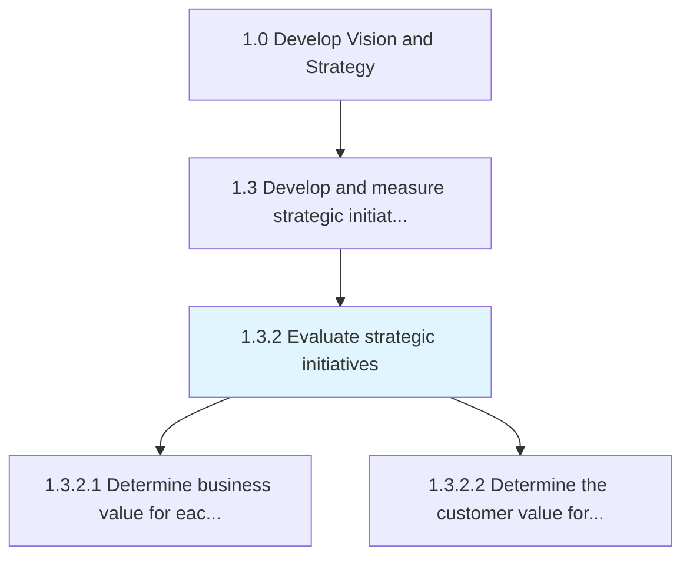
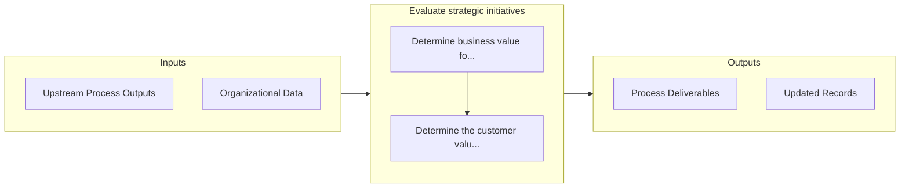

# Evaluate strategic initiatives

> Examining projects of strategic significance that lie outside the purview of the organization's routine operations.

## Overview

Process 1.3.2 is a core process that defines the specific procedures for evaluate strategic initiatives. 

Examining projects of strategic significance that lie outside the purview of the organization's routine operations. Closely analyze strategic initiatives for their applicability and feasibility, given the organization's vision.

## Process Hierarchy



## Key Statistics

| Metric | Value |
|--------|-------|
| APQC Code | 10058 |
| Hierarchy ID | 1.3.2 |
| Level | Process |
| Parent | [1.3](../) |
| Sub-Processes | 2 |


## GraphDL Semantic Structure

```
evaluate.StrategicInitiatives
```

| Component | Value | Description |
|-----------|-------|-------------|
| Verb | `evaluate` | Primary action |
| Object | `strategic initiatives` | Direct object |


## Process Flow



## Sub-Processes

| Process | Hierarchy ID | Description |
|---------|-------------|-------------|
| [Determine business value for each strategic priority](./DetermineBusinessValueForEachStrategicPriority) | 1.3.2.1 | Establishing a standard measure of value to determine the business worth for each of the Identify st |
| [Determine the customer value for each strategic priority](./DetermineTheCustomerValueForEachStrategicPriority) | 1.3.2.2 | Analyzing the value preposition; the value the customer gets from a product/services for each of you |


## Related Concepts

- [StrategicInitiatives](/concepts/StrategicInitiatives)


---

*Source: APQC PCF 10058 (1.3.2) - APQC*
