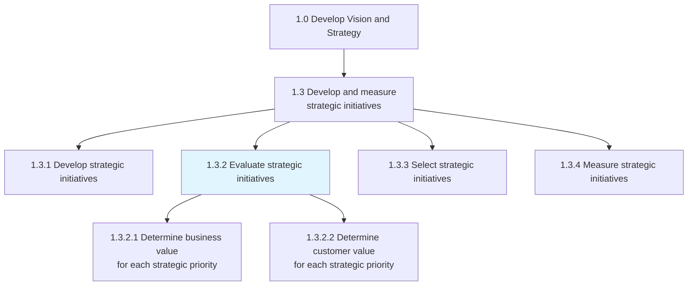
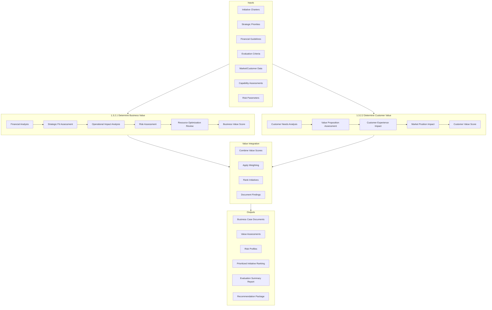
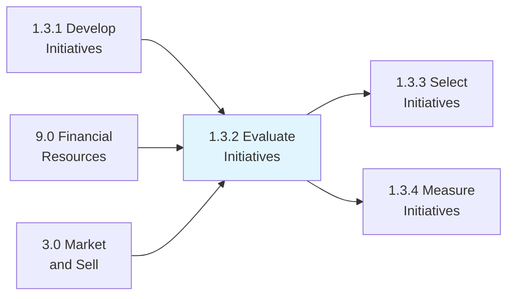

# Evaluate strategic initiatives

> Examining projects of strategic significance that lie outside the purview of the organization's routine operations.

## Overview

Process 1.3.2 - Evaluate Strategic Initiatives is a critical process that subjects proposed strategic initiatives to rigorous analysis before resource allocation decisions are made. This evaluation process ensures that organizations invest in initiatives that deliver the highest value relative to their cost, risk, and strategic fit.

The evaluation process examines initiatives from multiple perspectives: financial (ROI, NPV, payback period), strategic (alignment with vision and goals), operational (feasibility and capability requirements), and customer (value delivered to customers). By applying consistent evaluation criteria, organizations can compare diverse initiatives on a common basis and make informed portfolio decisions.

This process produces detailed business cases and value assessments that feed into the initiative selection process (1.3.3). The quality of evaluation directly impacts the quality of strategic investment decisions and ultimately organizational performance.

## Process Hierarchy



## Key Statistics

| Metric | Value |
|--------|-------|
| APQC Code | 10058 |
| Hierarchy ID | 1.3.2 |
| Level | Process |
| Parent | [1.3 Develop and Measure Strategic Initiatives](../) |
| Child Activities | 2 |
| Typical Duration | 2-4 weeks per initiative |
| Cycle Timing | Concurrent with 1.3.1 or following |

## GraphDL Semantic Structure

```graphdl
evaluate.StrategicInitiatives
```

| Component | Value | Description |
|-----------|-------|-------------|
| Verb | `evaluate` | Assessing and analyzing |
| Object | `StrategicInitiatives` | Proposed strategic projects |
| Preposition | - | Not applicable |
| PrepObject | - | Not applicable |

## Process Flow



## Sub-Processes

### [1.3.2.1 Determine business value for each strategic priority](./DetermineBusinessValueForEachStrategicPriority/)

Establishing a standard measure of value to determine the business worth for each strategic initiative. This includes financial analysis, strategic alignment assessment, and risk evaluation.

**Key Activities:**
- Conduct financial analysis (ROI, NPV, IRR, payback)
- Assess strategic alignment and priority fit
- Evaluate operational feasibility and impact
- Perform risk assessment and mitigation planning
- Analyze resource requirements and constraints
- Calculate composite business value score

**APQC Code:** 10063 | **Typical Duration:** 1-2 weeks

### [1.3.2.2 Determine the customer value for each strategic priority](./DetermineTheCustomerValueForEachStrategicPriority/)

Analyzing the value proposition - the value the customer gets from products/services - for each strategic initiative. This ensures initiatives deliver meaningful customer outcomes.

**Key Activities:**
- Analyze customer needs and pain points
- Assess value proposition strength
- Evaluate customer experience impact
- Measure market position improvement potential
- Gather customer validation data
- Calculate composite customer value score

**APQC Code:** 10064 | **Typical Duration:** 1-2 weeks

## Evaluation Criteria Framework

### Financial Metrics

| Metric | Description | Threshold | Weight |
|--------|-------------|-----------|--------|
| Return on Investment (ROI) | Net benefits divided by costs | >15% | 20% |
| Net Present Value (NPV) | Present value of future cash flows | Positive | 15% |
| Payback Period | Time to recover investment | <3 years | 10% |
| Internal Rate of Return (IRR) | Discount rate where NPV = 0 | >WACC | 10% |

### Strategic Metrics

| Metric | Description | Threshold | Weight |
|--------|-------------|-----------|--------|
| Strategic Alignment | Fit with strategic priorities | High | 15% |
| Competitive Impact | Effect on market position | Positive | 10% |
| Capability Building | New organizational capabilities | Significant | 5% |

### Customer Metrics

| Metric | Description | Threshold | Weight |
|--------|-------------|-----------|--------|
| Customer Value Score | Benefit delivered to customers | High | 10% |
| Customer Satisfaction Impact | Expected satisfaction improvement | Positive | 5% |

## RACI Matrix

| Activity | Responsible | Accountable | Consulted | Informed |
|----------|-------------|-------------|-----------|----------|
| Financial analysis | Finance Team | CFO | Strategy, PMO | Sponsors |
| Strategic alignment assessment | Strategy Team | CSO | Executives | Board |
| Operational feasibility | Operations | COO | IT, HR | Finance |
| Risk assessment | Risk Management | CRO | All Functions | Audit |
| Customer value analysis | Marketing/Product | CMO/CPO | Sales, Service | Strategy |
| Value integration | Strategy/PMO | CSO | Finance | All |
| Recommendation development | Strategy Team | CEO | All Executives | Board |

## Metrics & KPIs

| Metric | Description | Target | Frequency |
|--------|-------------|--------|-----------|
| Evaluation Completion Rate | Initiatives fully evaluated | 100% | Per cycle |
| Evaluation Accuracy | Predicted vs. actual value delivered | >80% | Post-implementation |
| Time to Evaluation | Days from charter to evaluation complete | <21 days | Per initiative |
| Business Case Quality | Business cases meeting standards | >90% | Per cycle |
| Value Forecast Variance | Deviation from projected value | <20% | Annually |
| Customer Value Validation | Initiatives validated by customers | >50% | Per initiative |
| Risk Prediction Accuracy | Predicted vs. actual risk occurrence | >75% | Post-implementation |

## Related Departments

| Department | Role in Initiative Evaluation |
|------------|------------------------------|
| Finance | Financial analysis and business case |
| Strategy | Strategic alignment and value integration |
| Operations | Feasibility and operational impact |
| Risk Management | Risk assessment and mitigation |
| Marketing | Customer value analysis |
| Product | Value proposition assessment |
| PMO | Evaluation process coordination |

## Related Occupations

- [Financial Analysts](/occupations/Business/FinancialAnalysts) - Business case development
- [Strategic Planners](/occupations/Business/StrategicPlanners) - Strategic alignment assessment
- [Business Analysts](/occupations/Business/ManagementAnalysts) - Value analysis
- [Risk Managers](/occupations/Business/RiskManagers) - Risk assessment
- [Market Research Analysts](/occupations/Business/MarketResearchAnalysts) - Customer value analysis
- [Project Managers](/occupations/Business/ProjectManagers) - Feasibility assessment

## Industry Variations

### Technology
Emphasis on time-to-market and competitive timing. Technical feasibility heavily weighted. Customer acquisition and retention metrics prominent. Shorter evaluation cycles aligned with rapid innovation.

### Healthcare
Regulatory approval requirements factored into timelines. Clinical evidence requirements for value claims. Patient outcome metrics critical. Longer evaluation cycles for capital-intensive initiatives.

### Financial Services
Regulatory compliance as gating criterion. Risk-adjusted return calculations standard. Customer trust and security metrics prominent. Operational resilience requirements.

### Manufacturing
Capital budgeting discipline rigorous. Capacity and throughput impact analysis. Supply chain implications evaluated. Environmental and safety considerations.

### Retail
Speed to market and seasonal timing critical. Customer experience impact heavily weighted. Store operations feasibility important. Omnichannel integration requirements.

## Evaluation Best Practices

### Financial Analysis
- Use consistent financial assumptions across initiatives
- Apply appropriate discount rates and time horizons
- Consider both hard and soft benefits
- Validate assumptions with historical data
- Include sensitivity analysis for key variables

### Strategic Assessment
- Use strategic priority framework as reference
- Assess contribution to multiple strategic goals
- Consider capability building value
- Evaluate competitive response implications
- Factor in timing and sequencing effects

### Customer Value
- Base analysis on validated customer needs
- Use customer data and research where available
- Consider different customer segment impacts
- Evaluate customer experience end-to-end
- Include voice of customer validation

### Risk Evaluation
- Identify all risk categories (execution, market, technology)
- Quantify probability and impact
- Develop mitigation strategies
- Consider risk interdependencies
- Apply risk-adjusted valuation

## Related Processes



## Evaluation Templates

### Business Case Structure
1. Executive Summary
2. Problem/Opportunity Statement
3. Strategic Alignment
4. Solution Description
5. Financial Analysis
6. Customer Value Assessment
7. Risk Assessment
8. Implementation Approach
9. Resource Requirements
10. Success Metrics
11. Recommendation

### Value Scoring Matrix

| Criterion | Weight | Low (1) | Medium (3) | High (5) | Score |
|-----------|--------|---------|------------|----------|-------|
| Financial Return | 25% | ROI <10% | ROI 10-20% | ROI >20% | - |
| Strategic Fit | 20% | Partial | Good | Excellent | - |
| Customer Value | 15% | Minimal | Moderate | Significant | - |
| Feasibility | 15% | Challenging | Manageable | Straightforward | - |
| Risk Profile | 15% | High | Medium | Low | - |
| Time to Value | 10% | >3 years | 1-3 years | <1 year | - |

## Related Concepts

- Strategic Initiatives
- Business Value
- Customer Value
- Return on Investment
- Strategic Alignment
- Risk Assessment
- Portfolio Optimization

---

*Source: APQC PCF 10058 (1.3.2) - Cross-Industry*
