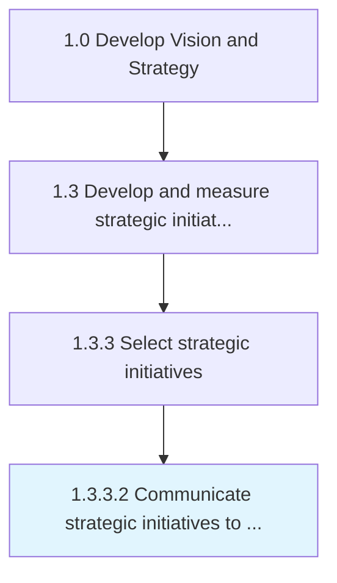

# Communicate strategic initiatives to business units and stakeholders

> Establishing procedures for communications within the organization which creates the road map for successful understanding of strategic initiatives for both business units and stakeholders (internal and external).

## Overview

Activity 1.3.3.2 is an activity within the Develop Vision and Strategy framework. 

Establishing procedures for communications within the organization which creates the road map for successful understanding of strategic initiatives for both business units and stakeholders (internal and external).

## Process Hierarchy



## Key Statistics

| Metric | Value |
|--------|-------|
| APQC Code | 19981 |
| Hierarchy ID | 1.3.3.2 |
| Level | Activity |
| Parent | [1.3.3](../) |
| Sub-Processes | 0 |


## GraphDL Semantic Structure

```
communicate.StrategicInitiatives.to.BusinessUnitsAndStakeholders
```

| Component | Value | Description |
|-----------|-------|-------------|
| Verb | `communicate` | Primary action |
| Object | `strategic initiatives` | Direct object |
| Preposition | `to` | Relationship |
| PrepObject | `business units and stakeholders` | Indirect object |


## Related Concepts

- [StrategicInitiatives](/concepts/StrategicInitiatives)
- [BusinessUnits](/concepts/BusinessUnits)
- [StrategicInitiatives](/concepts/StrategicInitiatives)
- [Stakeholders](/concepts/Stakeholders)


---

*Source: APQC PCF 19981 (1.3.3.2) - APQC*
